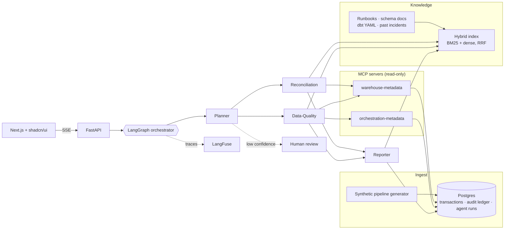

# ReconMind

[](https://github.com/rahulramachandran-labs/reconmind/actions/workflows/ci.yml)
[](LICENSE)
[](pyproject.toml)

ReconMind is a multi-agent, RAG-powered copilot that watches a synthetic data pipeline for key-mismatch, dedup, and schema-drift incidents, investigates them the way a senior data engineer would, and produces an incident write-up a human can act on. It is production RAG plus agentic orchestration applied to real data-engineering problems, not generic document Q&A.

Built as my final project for the IIT Patna Generative AI & Agentic AI for Developers program.

**Live:** [reconmind-labs.vercel.app](https://reconmind-labs.vercel.app) · **Deck:** [PDF](docs/slides/Rahul_Ramachandran_ReconMind-ProjectSubmission.pdf) / [PPTX](docs/slides/Rahul_Ramachandran_ReconMind-ProjectSubmission.pptx)

[](docs/slides/Rahul_Ramachandran_ReconMind-ProjectSubmission.pdf)

## What it catches

| Failure mode | What it looks like | Why it hurts |
|---|---|---|
| Key drift | One `location_id` reporting under two `outlet_id`s | Store-level numbers split, a "new" store appears with no history |
| Duplicate submissions | Same `transaction_id + channel_basket_id + upc_code` in two submitter files | Revenue double counted unless the latest file wins |
| Schema drift | A batch drops or renames a contracted column | Dedup silently stops working for that batch |
| Volume anomaly | A day lands 40% below its trailing average | Usually a truncated or late file, sometimes real |

All data is synthetic. No real company, schema or business logic is referenced anywhere.

## Architecture



The diagram is the target shape. What is live today is tracked in the build status below.

## Build status

| Phase | Scope | State |
|---|---|---|
| A | Single LLM + dense RAG over the docs corpus, FastAPI, one Next.js page, CI | shipped |
| B | Seeded generator, hybrid retrieval, Postgres + ledger, provider fallback, RAGAS gate | next |
| C | MCP servers, LangGraph with four agents, LangFuse, human review | planned |
| D | Auth, scheduler, chaos suite, latency budget, dashboard, deploy polish | planned |

## Run it locally

Needs Python 3.12 with [uv](https://docs.astral.sh/uv/), Node 20+, and optionally [Ollama](https://ollama.com) for local LLM answers.

```bash
make bootstrap   # uv sync, npm ci, git hooks, .env from .env.example
make dev         # api on :8000, web on :3000
```

With no LLM configured the API still answers, extractively, from the retrieved passages, and says so. Set `LLM_PROVIDER=ollama` (default, `ollama pull qwen2.5:1.5b`) or `LLM_PROVIDER=openai` with `OPENAI_API_KEY` for generated answers.

```bash
curl -s localhost:8000/ask -H 'content-type: application/json' \
  -d '{"question": "which file wins when a submitter resends?"}' | jq .answer
```

## Repository layout

```
app/            FastAPI app, retrieval, LLM client
corpus/         synthetic runbooks, schema docs, past incident write-ups
frontend/       Next.js App Router + shadcn/ui
tests/          unit and integration tests
docs/           ADRs, slides, blog draft
```

## Make targets

`make help` lists everything. The ones that matter: `bootstrap`, `dev`, `test`, `lint`, `sync` (hooks, tests, commit, push), `deploy`.

## Decisions

Architecture decisions are written up in [docs/adr](docs/adr). Changes by phase are in [CHANGELOG.md](CHANGELOG.md).

## License

MIT
