# ReconMind

**When a data pipeline's numbers go wrong, someone has to work out why: which file, which key, how many rows, and what to do about it. I've spent years doing that by hand. ReconMind hands the investigation to a small team of AI agents.** They read the live pipeline through MCP tools, look up the team's runbooks and past incidents, and hand back an incident report with record counts, a likely root cause, a fix and a confidence score. Anything serious or uncertain waits for a person to sign it off.

**Catches four failure modes in multi-source data pipelines:**

| | |
|---|---|
| **[Key drift](#key-drift)**<br>a store starts reporting under a second id | **[Duplicate submission](#duplicate-submission)**<br>a file is resent after the nightly load |
| **[Schema drift](#schema-drift)**<br>a column is renamed | **[Volume anomaly](#volume-anomaly)**<br>one feed arrives 40% light |

[](https://github.com/rahulramachandran-labs/reconmind/actions/workflows/ci.yml)
[](LICENSE)
[](https://github.com/rahulramachandran-labs/reconmind/releases/latest)

[](pyproject.toml)
[](app/api)
[](app/agents/graph.py)
[](app/retrieval/hybrid.py)
[](mcp_servers)
[](docker-compose.yml)
[](app/retrieval/dense.py)
[](app/retrieval/embeddings.py)
[](evals/run_ragas.py)
[](app/observability/tracer.py)
[](frontend/package.json)
[](frontend/components.json)
[](frontend/package.json)
[](docker-compose.yml)
[](frontend/vercel.json)
[](render.yaml)
[](.github/workflows/ci.yml)
[](app/llm/providers.py)
[](app/llm/providers.py)

| | |
|---|---|
| **Program** | Final project for the IIT Patna Generative AI & Agentic AI for Developers program, by Rahul Ramachandran, submitted September 2026. All data is synthetic. |
| **Author** | Rahul Ramachandran |
| **Live app** | [reconmind-labs.vercel.app](https://reconmind-labs.vercel.app) |
| **API** | [/healthz](https://reconmind-labs-api.onrender.com/healthz) · [/docs](https://reconmind-labs-api.onrender.com/docs) |
| **Project deck** | [PDF](docs/slides/Rahul_Ramachandran_ReconMind-ProjectSubmission.pdf) |
| **Demo video** | [Watch it here in the page](#how-it-works) · [MP4, two minutes](https://github.com/rahulramachandran-labs/reconmind/releases/download/v1.1.0/demo.mp4) |
| **Write-up** | [How I built it](docs/blog/reconmind-writeup.md) |
| **Docs** | [Getting around](docs/GUIDE.md) · [Decision records](docs/adr/README.md) · [Demo script](docs/DEMO.md) |

---

## Try it in five minutes

1. Open the [API health check](https://reconmind-labs-api.onrender.com/healthz) first: it runs on a free instance that sleeps when idle, so the first request wakes it and can take a minute.
2. Open **[reconmind-labs.vercel.app](https://reconmind-labs.vercel.app)**. The dashboard charts 14 days of volume, and 2026-06-18 is visibly short.
3. Choose *Sign in*, then **Continue as the demo reviewer**. Reading needs no account; scanning and signing off do.
4. Click **Run a scan**. Four findings come back, one S1 and three S2. The S1 waits in the **Review queue**, with the reason it paused: add a note and approve it.
5. In **Ask ReconMind**, ask *Did the MOBILE file have a schema problem on 2026-06-16?* The Planner sends it to Data-Quality alone. Open that run on **Traces** for every tool call, retrieval and model call, with latency and cost.

The same walkthrough, narrated: [docs/DEMO.md](docs/DEMO.md).

## Core concepts

<!-- evidence:course -->
Every module the course covered is in here somewhere. Each row links to the code that does it and to the test that covers it, pinned to commit `1bf31ac`. [docs/COURSE_MAPPING.md](docs/COURSE_MAPPING.md) says more about each.

| Concept area | How it is used here | Where | Proof |
|---|---|---|---|
| GenAI foundations | Delimited, untrusted context in prompts; Pydantic-validated structured output with a retry loop | [`format_passages`](https://github.com/rahulramachandran-labs/reconmind/blob/1bf31accf5405378d0664355fed17ce8d0a0f096/app/rag/prompts.py#L38-L44) · [`structured`](https://github.com/rahulramachandran-labs/reconmind/blob/1bf31accf5405378d0664355fed17ce8d0a0f096/app/llm/structured.py#L26-L81) | [planted injection](https://github.com/rahulramachandran-labs/reconmind/blob/1bf31accf5405378d0664355fed17ce8d0a0f096/tests/integration/test_prompt_injection.py#L55-L87) · [re-prompt on invalid JSON](https://github.com/rahulramachandran-labs/reconmind/blob/1bf31accf5405378d0664355fed17ce8d0a0f096/tests/unit/test_structured.py#L49-L56) |
| Models and APIs | Provider abstraction and fallback across OpenAI, Anthropic, Groq, Gemini, OpenRouter and Ollama; token and cost accounting per call | [`build_providers`](https://github.com/rahulramachandran-labs/reconmind/blob/1bf31accf5405378d0664355fed17ce8d0a0f096/app/llm/providers.py#L220-L310) · [`LLMChain`](https://github.com/rahulramachandran-labs/reconmind/blob/1bf31accf5405378d0664355fed17ce8d0a0f096/app/llm/providers.py#L321-L422) | [fallback order](https://github.com/rahulramachandran-labs/reconmind/blob/1bf31accf5405378d0664355fed17ce8d0a0f096/tests/unit/test_llm_chain.py#L38-L43) · [rate-limited free tier](https://github.com/rahulramachandran-labs/reconmind/blob/1bf31accf5405378d0664355fed17ce8d0a0f096/tests/unit/test_llm_chain.py#L236-L261) |
| LangChain | Markdown and dbt YAML loaders, section-aware splitting, a `BaseRetriever`, a `ChatPromptTemplate` with a `MessagesPlaceholder`, chat memory as a `BaseChatMessageHistory` over Postgres | [`load_corpus`](https://github.com/rahulramachandran-labs/reconmind/blob/1bf31accf5405378d0664355fed17ce8d0a0f096/app/retrieval/corpus.py#L28-L45) · [`chunk_docs`](https://github.com/rahulramachandran-labs/reconmind/blob/1bf31accf5405378d0664355fed17ce8d0a0f096/app/retrieval/chunking.py#L9-L40) · [`HybridRetriever`](https://github.com/rahulramachandran-labs/reconmind/blob/1bf31accf5405378d0664355fed17ce8d0a0f096/app/retrieval/hybrid.py#L35-L84) · [`ANSWER_PROMPT`](https://github.com/rahulramachandran-labs/reconmind/blob/1bf31accf5405378d0664355fed17ce8d0a0f096/app/rag/prompts.py#L65-L78) · [`SessionHistory`](https://github.com/rahulramachandran-labs/reconmind/blob/1bf31accf5405378d0664355fed17ce8d0a0f096/app/memory/sessions.py#L103-L123) | [chunk metadata](https://github.com/rahulramachandran-labs/reconmind/blob/1bf31accf5405378d0664355fed17ce8d0a0f096/tests/unit/test_corpus.py#L38-L44) · [LangChain retriever](https://github.com/rahulramachandran-labs/reconmind/blob/1bf31accf5405378d0664355fed17ce8d0a0f096/tests/unit/test_hybrid.py#L57-L61) · [prompt template](https://github.com/rahulramachandran-labs/reconmind/blob/1bf31accf5405378d0664355fed17ce8d0a0f096/tests/unit/test_rag.py#L114-L124) · [message history](https://github.com/rahulramachandran-labs/reconmind/blob/1bf31accf5405378d0664355fed17ce8d0a0f096/tests/unit/test_sessions.py#L65-L75) |
| RAG | Chunking, BM25 + dense hybrid, RRF, reranking, a RAGAS gate in CI | [`tokenize`](https://github.com/rahulramachandran-labs/reconmind/blob/1bf31accf5405378d0664355fed17ce8d0a0f096/app/retrieval/bm25.py#L20-L37) · [`rrf`](https://github.com/rahulramachandran-labs/reconmind/blob/1bf31accf5405378d0664355fed17ce8d0a0f096/app/retrieval/hybrid.py#L15-L32) · [reranker](https://github.com/rahulramachandran-labs/reconmind/blob/1bf31accf5405378d0664355fed17ce8d0a0f096/app/retrieval/rerank.py#L18-L32) · [offline judge](https://github.com/rahulramachandran-labs/reconmind/blob/1bf31accf5405378d0664355fed17ce8d0a0f096/evals/run_ragas.py#L116-L150) · [RAGAS job](.github/workflows/ci.yml) | [RRF](https://github.com/rahulramachandran-labs/reconmind/blob/1bf31accf5405378d0664355fed17ce8d0a0f096/tests/unit/test_hybrid.py#L38-L44) · [exact identifiers](https://github.com/rahulramachandran-labs/reconmind/blob/1bf31accf5405378d0664355fed17ce8d0a0f096/tests/unit/test_hybrid.py#L64-L71) |
| Agentic AI | LangGraph StateGraph, conditional edges, parallel specialists, checkpoints, human-in-the-loop, and an Explorer where the model chooses its own tools | [`build_graph`](https://github.com/rahulramachandran-labs/reconmind/blob/1bf31accf5405378d0664355fed17ce8d0a0f096/app/agents/graph.py#L53-L129) · [`interrupt()`](https://github.com/rahulramachandran-labs/reconmind/blob/1bf31accf5405378d0664355fed17ce8d0a0f096/app/agents/review.py#L30-L46) · [Postgres checkpointer](https://github.com/rahulramachandran-labs/reconmind/blob/1bf31accf5405378d0664355fed17ce8d0a0f096/app/agents/bootstrap.py#L43-L92) · [Explorer (tool choice)](https://github.com/rahulramachandran-labs/reconmind/blob/1bf31accf5405378d0664355fed17ce8d0a0f096/app/agents/explorer.py#L37-L93) | [parallel specialists](https://github.com/rahulramachandran-labs/reconmind/blob/1bf31accf5405378d0664355fed17ce8d0a0f096/tests/integration/test_agents.py#L121-L131) · [pause and resume](https://github.com/rahulramachandran-labs/reconmind/blob/1bf31accf5405378d0664355fed17ce8d0a0f096/tests/integration/test_agents.py#L47-L70) · [model picks tools](https://github.com/rahulramachandran-labs/reconmind/blob/1bf31accf5405378d0664355fed17ce8d0a0f096/tests/integration/test_agents.py#L278-L302) |
| MCP | Host, client and server; two read-only servers; stdio vs HTTP transports | [warehouse server](https://github.com/rahulramachandran-labs/reconmind/blob/1bf31accf5405378d0664355fed17ce8d0a0f096/mcp_servers/warehouse_metadata/server.py#L183-L331) · [orchestration server](https://github.com/rahulramachandran-labs/reconmind/blob/1bf31accf5405378d0664355fed17ce8d0a0f096/mcp_servers/orchestration_metadata/server.py#L82-L180) · [`MCPToolBox`](https://github.com/rahulramachandran-labs/reconmind/blob/1bf31accf5405378d0664355fed17ce8d0a0f096/app/tools/mcp_toolbox.py#L34-L111) | [inputs validated, no SQL](https://github.com/rahulramachandran-labs/reconmind/blob/1bf31accf5405378d0664355fed17ce8d0a0f096/tests/integration/test_warehouse_mcp.py#L74-L99) · [read-only tools](https://github.com/rahulramachandran-labs/reconmind/blob/1bf31accf5405378d0664355fed17ce8d0a0f096/tests/unit/test_orchestration_mcp.py#L6-L9) |
| Observability and deployment | LangFuse tracing, FastAPI, Docker, Render and Vercel, CI/CD | [`RunTracer`](https://github.com/rahulramachandran-labs/reconmind/blob/1bf31accf5405378d0664355fed17ce8d0a0f096/app/observability/tracer.py#L120-L224) · [`TracedLLM`](https://github.com/rahulramachandran-labs/reconmind/blob/1bf31accf5405378d0664355fed17ce8d0a0f096/app/llm/traced.py#L14-L120) · [Dockerfile](Dockerfile) · [render.yaml](render.yaml) · [ci.yml](.github/workflows/ci.yml) | [LangFuse nesting](https://github.com/rahulramachandran-labs/reconmind/blob/1bf31accf5405378d0664355fed17ce8d0a0f096/tests/unit/test_tracer.py#L85-L105) · [every call traced](https://github.com/rahulramachandran-labs/reconmind/blob/1bf31accf5405378d0664355fed17ce8d0a0f096/tests/integration/test_agents.py#L97-L118) · [untraced call refused](https://github.com/rahulramachandran-labs/reconmind/blob/1bf31accf5405378d0664355fed17ce8d0a0f096/tests/unit/test_structured.py#L80-L83) |
<!-- /evidence:course -->

## How it works


Four submitters send a retail pipeline a daily file each. Over 21 days of seeded, synthetic data, four things go wrong: a store starts reporting under a second id (**key drift**), a file is resent after the nightly load (**duplicate submission**), a column is renamed (**schema drift**) and one feed arrives 40% light (**volume anomaly**). This is what ReconMind does about them:

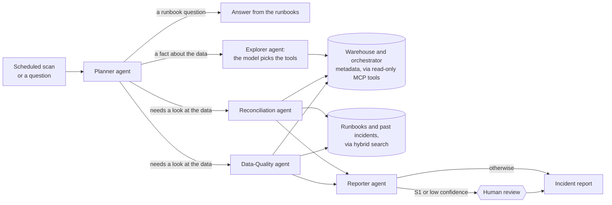

## Architecture

1. **Something starts a run.** A scan every six hours (GitHub Actions), a click on *Run a scan*, or a question in the chat. *Code:* [`refresh-demo.yml`](.github/workflows/refresh-demo.yml), [`app/api/`](app/api)
2. **The Planner decides who should look.** A general question ("which file wins when a submitter resends?") is answered straight from the runbooks. A question about a known kind of problem ("did the MOBILE file have a schema problem on 2026-06-16?") goes to the specialist that owns it, and a scan sends both. A plain question about the data that no check covers ("which submitter sent the fewest rows on the 18th?") goes to the Explorer, where the model picks up to three read-only tools itself and answers from what they return. *Code:* [`app/agents/planner.py`](app/agents/planner.py), [`app/agents/explorer.py`](app/agents/explorer.py)
3. **Specialists investigate in parallel.** *Reconciliation* checks for duplicate submissions and key drift; *Data-Quality* checks every file against the dbt contract and each day's volume against its trailing week. They get their facts by calling tools on two read-only **MCP servers** (a scan makes 30 tool calls), so every number is measured, not generated. *Code:* [`app/agents/specialists.py`](app/agents/specialists.py), [`app/domain/retail_recon/`](app/domain/retail_recon), [`mcp_servers/`](mcp_servers)
4. **They look up what the team already knows.** Hybrid search (BM25 + embeddings, fused, then reranked) finds the matching runbook and any past incident with the same pattern. A model, or a template when no model is configured, turns facts plus runbooks into a root cause, fix steps and a confidence score. A grounding check sends the write-up back if it states a time, number or id that isn't in the evidence. *Code:* [`app/retrieval/`](app/retrieval), [`app/rag/`](app/rag)
5. **The Reporter writes it up and decides who signs off.** Each finding becomes a structured incident report. S1 findings and anything below the confidence threshold **pause** the LangGraph run in a review queue; a reviewer approves, rejects or annotates, and the run resumes from its Postgres checkpoint. Every decision goes into an append-only audit ledger. *Code:* [`app/agents/reporter.py`](app/agents/reporter.py), [`app/agents/review.py`](app/agents/review.py)
6. **Everything is traced.** Every agent step, tool call, retrieval and model call is stored with its latency and cost and shown on the Traces page, and mirrored to LangFuse when its keys are set. *Code:* [`app/observability/`](app/observability)

[docs/ARCHITECTURE.md](docs/ARCHITECTURE.md) has the layer-by-layer view: the graph node by node, both MCP servers, the retrieval pipeline, the data model and where state lives.

## Tech stack

| Layer | Tools | Role in ReconMind | Why this |
|---|---|---|---|
| Agents | LangGraph (StateGraph, parallel nodes, `interrupt()`, Postgres checkpointer), LangChain, Pydantic | Wires Planner → specialists → Reporter → human review, and holds a paused run until someone decides | A graph I can draw, checkpoint and resume, rather than a conversation between roles ([ADR 0007](docs/adr/0007-langgraph-over-crewai.md)) |
| Tools | MCP: two read-only servers over stdio, streamable HTTP or in-process | Every fact about the warehouse and the orchestrator arrives as a tool call | One protocol, one place to validate arguments and record every call ([ADR 0008](docs/adr/0008-mcp-over-direct-clients.md)) |
| Retrieval | BM25 (`rank_bm25`, Snowball), sentence-transformers / fastembed, FAISS or Pinecone, reciprocal rank fusion, cross-encoder reranker | Finds the runbook and the past incident behind each finding | Pipelines are full of identifiers, and BM25 matches them where embeddings blur them ([ADR 0002](docs/adr/0002-hybrid-retrieval-with-rrf.md)); chunks keep their section titles ([ADR 0001](docs/adr/0001-chunk-by-markdown-section.md)); FAISS in process, Pinecone behind `VECTOR_STORE`, ONNX embeddings in the container ([ADR 0003](docs/adr/0003-onnx-embeddings-in-the-container.md)) |
| Models | OpenAI, Anthropic, Groq, Google Gemini, OpenRouter, Ollama, with a fallback chain and an extractive floor | Write the root cause, the fix and the confidence; the checks own every number | A chain that degrades instead of failing, down to no model at all ([ADR 0005](docs/adr/0005-provider-fallback-chain.md), [ADR 0010](docs/adr/0010-facts-from-checks-language-from-models.md)) |
| Backend | FastAPI, uvicorn, SQLAlchemy 2, Alembic, psycopg, Postgres 16, sse-starlette, APScheduler | REST and the chat's server-sent events, migrations, runs and reports, the optional in-process scan timer | The audit ledger is kept append-only by the database itself, not by application code ([ADR 0004](docs/adr/0004-append-only-ledger-in-postgres.md)) |
| Frontend | Next.js 16 (App Router), React 19, shadcn/ui on Radix, Tailwind CSS, Auth.js, react-markdown | Dashboard, incidents, review queue, chat, docs and traces | Writes go through the app's own route handlers, so the API's write token stays on the server and never reaches the browser |
| Quality and ops | RAGAS, pytest, ruff, black, mypy, LangFuse, Docker, GitHub Actions, gitleaks, pre-commit, Render, Vercel | Gates every push, traces every run, deploys both halves | Offline judges keep the gate deterministic and free ([ADR 0006](docs/adr/0006-offline-eval-judges.md)); traces land in Postgres first and LangFuse second, so a missing key loses nothing ([ADR 0009](docs/adr/0009-tracing-langfuse-and-postgres.md)) |

## Results

<!-- evidence:results -->
From the last capture, on 2026-09-23: a freshly seeded local stack with Groq's free tier first in the fallback chain, and every scenario in the tour above ([`docs/evidence/`](docs/evidence/README.md)). Planted sizes are from [`expected_anomalies.json`](data/sample/expected_anomalies.json).

| Planted anomaly | Planted size | Finding produced | Severity | Outcome | Written by |
|---|---|---|---|---|---|
| <a id="schema-drift"></a>Schema drift | `S1003_20260616_0216_MOBILE.txt` renames `channel_basket_id` to `basket_ref`: 82 rows | S1003_20260616_0216_MOBILE.txt renamed channel_basket_id to basket_ref; 82 records | S1, as expected | held for review | `groq/openai/gpt-oss-120b` |
| <a id="key-drift"></a>Key drift | `LOC-0517` also reports as `OUT-1071`: 251 of 8,373 rows | LOC-0517 also reporting as OUT-1071 (3.0% of rows); 251 records | S2, as expected | published | `groq/openai/gpt-oss-120b` |
| <a id="duplicate-submission"></a>Duplicate submission | `S1002_20260612_1120_ECOMM.txt` supersedes 88 rows, 3 with changed values, after the DAG ran | Resent file S1002_20260612_1120_ECOMM.txt supersedes 88 rows; 88 records | S2, as expected | published | `groq/openai/gpt-oss-120b` |
| <a id="volume-anomaly"></a>Volume anomaly | `S1001_20260618_0638_POSFEED.txt`: 110 rows vs 182.6 trailing, 161 min late | S1001 2026-06-18: 110 rows, 40% below its 7-day average; 73 records | S2, as expected | published | `groq/openai/gpt-oss-120b` |

All four planted anomalies were found, each by the specialist expected to find it and at the expected severity, and nothing else was flagged. The scan took 27.2 s from the request to four written-up findings: 5 agent nodes, 30 MCP tool calls, 4 retrievals and 5 model calls (5,714 prompt and 2,283 completion tokens, $0.00 on the free tier).

Then the questions, each a real run:

- *Did the MOBILE file have a schema problem on 2026-06-16?* went to the Data-Quality agent in 2.8 s, 2 model calls. It said: *“S1: 82 rows missing channel_basket_id, dedup blocked.”*
- *Which file wins when a submitter resends the same day?* was answered from the runbooks in 2.2 s, 2 model calls. It said: *“The resend with the later timestamp in the file name wins.”*
- *What should we check before reprocessing that day?* was answered from the runbooks in 2.1 s, 2 model calls (asked in the same session, so the Planner saw the question before it). It said: *“Before reprocessing, first confirm that the corrected (resend) file has been landed with a later `HHMM` in its name, then run the reprocess and **compare the `publish_metrics` output to the file‑trailer counts** to verify the data matches the expected totals【2】.”*
- *Show me which submitter sent the fewest rows on 2026-06-18, and when its file landed.* went to the Explorer in 2.0 s, 3 model calls; the model chose `get_table_stats`. It said: *“The submitter with the fewest rows on 2026‑06‑18 was **S1004**, whose file contained **53 rows** and landed at **2026‑06‑19T04:13:00+00:00**.”*

Writing the S1 up again with `POST /incidents/{id}/regenerate` returned HTTP 200, `analysis_by: model`, from `groq/openai/gpt-oss-120b` in 1,403 ms, with the template's version kept beside it. Approving it with a note resumed its paused run and published it. A second scan took 1.3 s and paused for nothing; the feed still held 4 findings, each counted as seen again (the S1 3 times, counting any question that looked at it). It reused the stored write-ups rather than asking the model again, so its 1 model call went to the summary.

`make test`: 172 passed, 0 failed, 92.58% line and branch coverage ([`tests.txt`](docs/evidence/tests.txt)). The RAGAS gate: pass (faithfulness 0.911, answer relevancy 0.862, context precision 0.830, context recall 0.922). CI: [run 35824610838](https://github.com/rahulramachandran-labs/reconmind/actions/runs/35824610838) on `1bf31ac`, success.
<!-- /evidence:results -->

### Retrieval and answer quality

I wrote a golden set of 46 questions, each with a reference answer and the passages that support it, covering every anomaly type and every screen. [RAGAS](evals/run_ragas.py) scores it on every push, and CI fails if a metric drops below [its threshold](evals/thresholds.yaml). Each row says who wrote the answers and who judged them; all of them are in [`evals/history.csv`](evals/history.csv).

| Retriever | Answers written by | Judged by | Faithfulness | Answer relevancy | Context precision | Context recall |
|---|---|---|---|---|---|---|
| Dense only | extractive (no model) | offline | 0.920 | 0.863 | 0.661 | 0.844 |
| Hybrid (BM25 + dense, RRF) | extractive (no model) | offline | 0.917 | 0.864 | 0.756 | 0.911 |
| **Hybrid + reranker (default, the CI gate)** | **extractive (no model)** | **offline** | **0.911** | **0.862** | **0.830** | **0.922** |
| Hybrid + reranker | `openai/gpt-oss-120b` on Groq | offline | 0.566 | 0.943 | 0.830 | 0.922 |
| Hybrid + reranker | `openai/gpt-oss-120b` on Groq | `qwen/qwen3.8-27b` on Groq | **0.935** | 0.720 | 0.830 | 0.922 |
| Hybrid + reranker | `qwen2.5:1.5b`, local, through Ollama | offline | 0.427 | 0.624 | 0.830 | 0.922 |
| *Threshold* | | | *0.85* | *0.80* | *0.80* | *0.85* |

*Offline* means no language model grades anything: RAGAS's non-LLM context metrics, an NLI cross-encoder for faithfulness and an MS MARCO cross-encoder for relevancy ([ADR 0006](docs/adr/0006-offline-eval-judges.md)). The model rows keep retrieval the same and change who writes the answers. Groq's `gpt-oss-120b` answers well (relevancy 0.943), but the small NLI model credits only 0.566 of its sentences, because it doesn't recognise a paraphrase as support. So I had a different model grade the same model's answers in a second run: Qwen3.8-27B found 0.935 of the claims supported by the passages. Its relevancy (0.720) is RAGAS's embedding measure, not on the cross-encoder's scale. A 1.5-billion-parameter local model gets 0.427. That spread is why CI gates on extractive answers, and why the model-judged runs are a separate job, run by hand and on release tags.

## Screens

Captured at 1440×900 from a freshly seeded local stack with Groq's free tier writing the explanations (`uv run --with playwright python scripts/record_demo.py --screenshots docs/screenshots`). The same walkthrough as a two-minute captioned video: **[demo.mp4](https://github.com/rahulramachandran-labs/reconmind/releases/download/v1.1.0/demo.mp4)** (2.3 MB; GitHub will not play a file that size in the browser, so it downloads. The same run is the animated one under [How it works](#how-it-works)).

<!-- evidence:screens -->
| Screen | |
|---|---|
| **Dashboard**<br><br>Latest business date against its trailing week, open findings by severity with the S1 waiting for review, the last DAG run, and today's model calls, tokens and cost. The chart flags POSFEED's light day. | 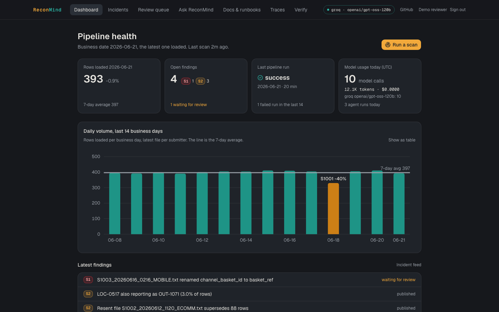 |
| **Incident feed**<br><br>One row per finding, with who wrote it up and how many scans have seen it. | 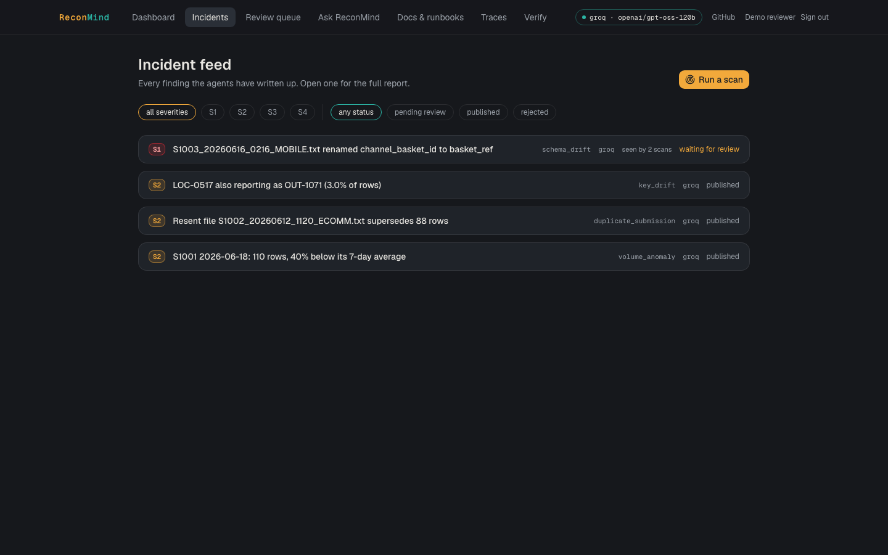 |
| **Incident detail: model analysis**<br><br>The key-drift report as the model wrote it. The chip names the model, its latency, tokens and cost. | 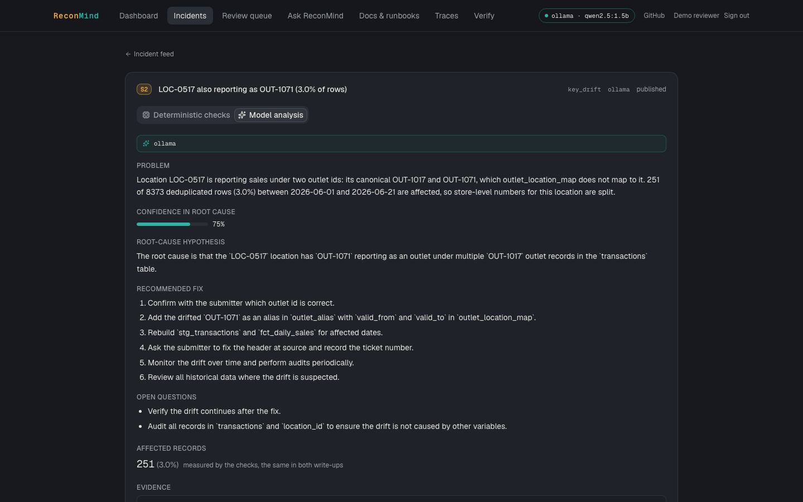 |
| **Incident detail: deterministic checks**<br><br>The template the model's answer is held against: the same problem and counts, and a calibrated confidence. *Side by side* shows both at once. | 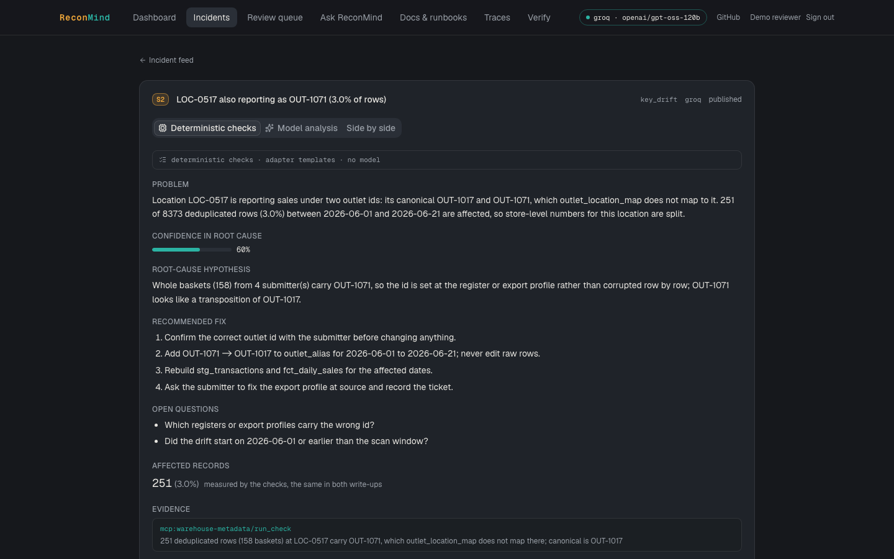 |
| **Review queue**<br><br>The S1 waits for a person, with the reason it paused. | 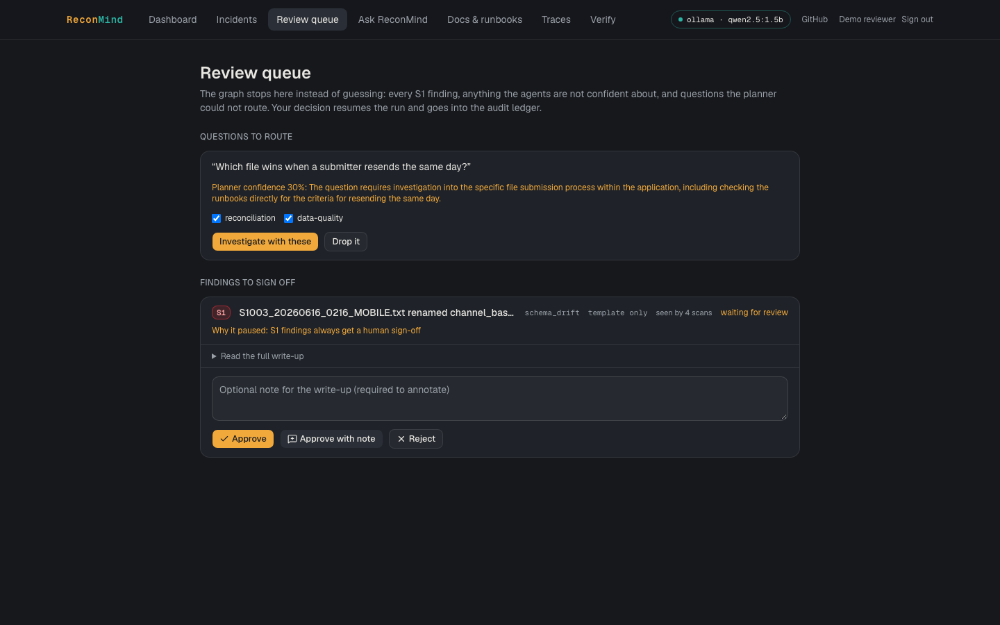 |
| **Ask ReconMind: an investigation**<br><br>The MOBILE question goes to Data-Quality only, and the steps stream in. From the captured run, the first two sentences of the answer, written by `groq/openai/gpt-oss-120b`: *“S1: 82 rows missing channel_basket_id, dedup blocked. The S1003_20260616_0216_MOBILE.txt file was renamed from channel_basket_id to basket_ref, breaking the raw.transactions contract.”* | 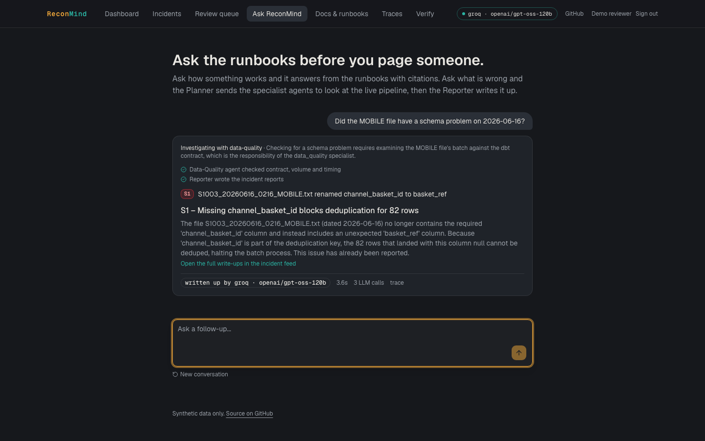 |
| **Ask ReconMind: a runbook question**<br><br>Answered from the runbooks with numbered citations, and the footer names the model that answered. | 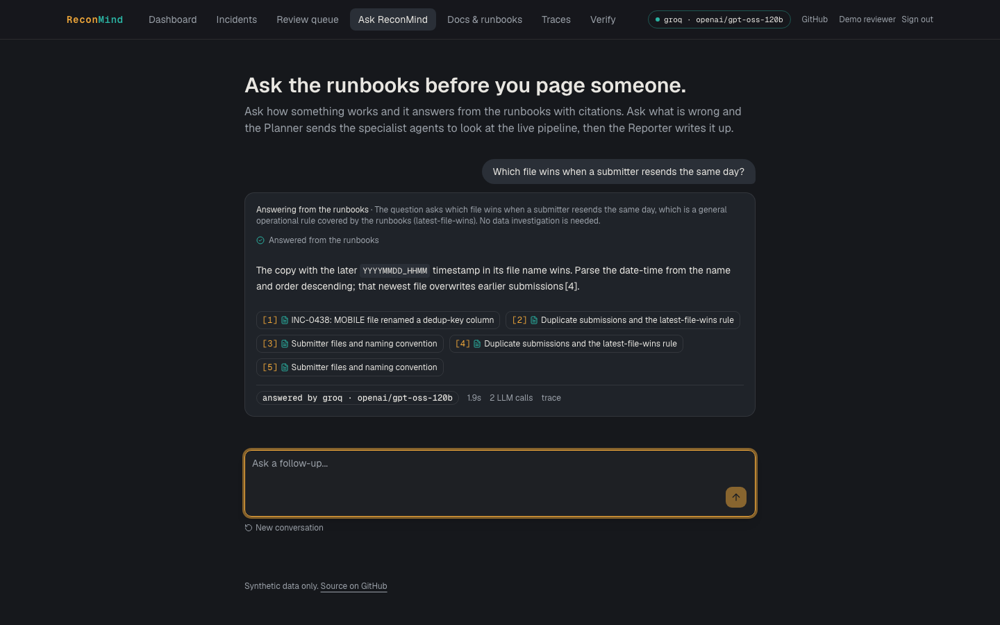 |
| **Ask ReconMind: a fact no check covers**<br><br>The Planner sends it to the Explorer, which picks the read-only tools itself (at most three), then answers from what they returned. | 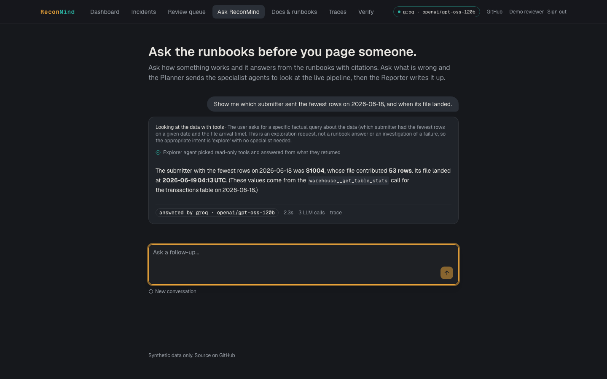 |
| **Traces**<br><br>The scan's trace: each agent, then its MCP tool calls, retrievals and model calls with their latency. The headline and summary at the top are the model's. | 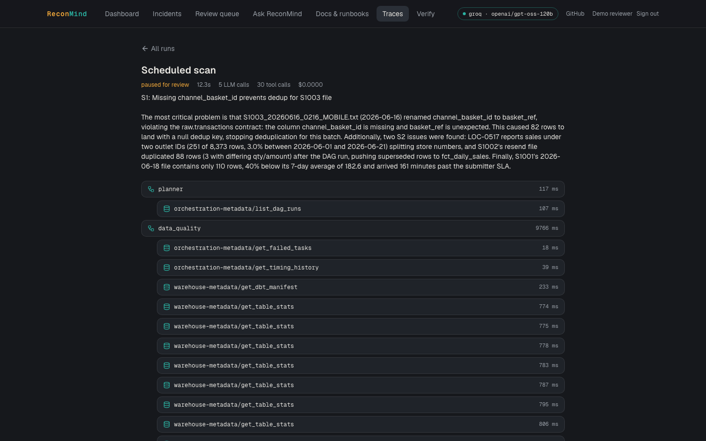 |
| **Docs & runbooks, hybrid**<br><br>`basket_ref ContractViolation` with hybrid search: the schema-drift runbook and incident INC-0438 come first. The badges show each hit's dense and BM25 rank; INC-0438 is 10th on meaning alone and 1st on keywords. | 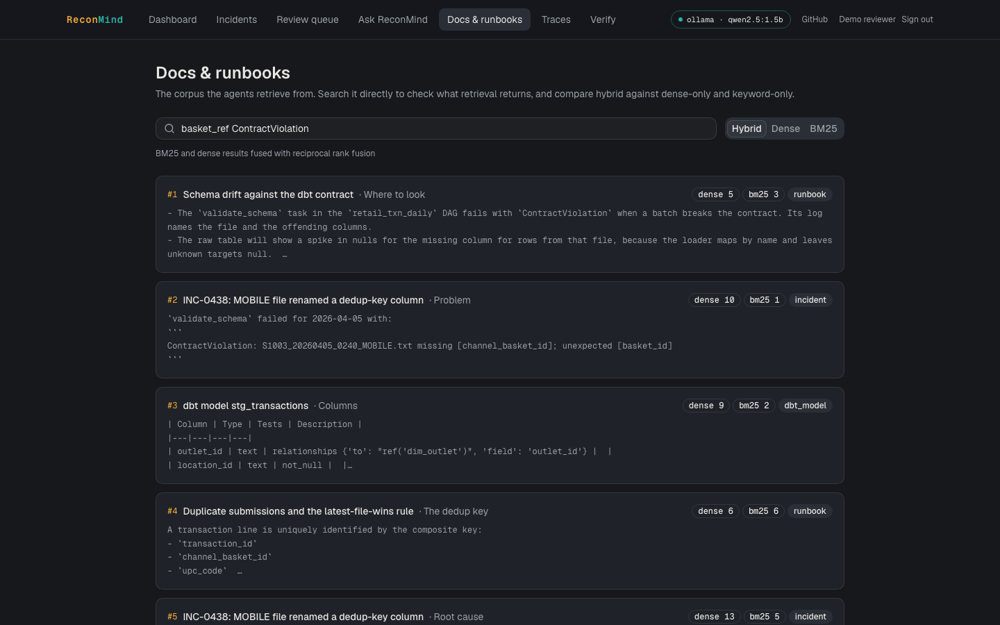 |
| **Docs & runbooks, dense only**<br><br>The same query with embeddings only: docs and dbt models for the transactions table fill the top four, the runbook is 5th and the incident isn't in the top five. | 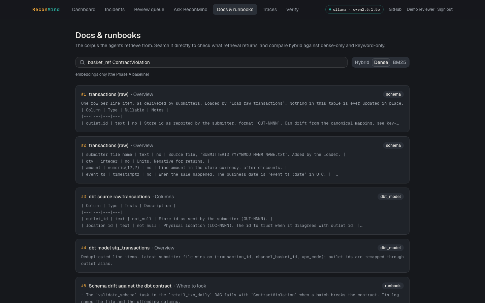 |
| **Verify**<br><br>Each planted anomaly beside the finding this deployment produced, the chaos test that proves it, and the template's and the model's root causes side by side. | 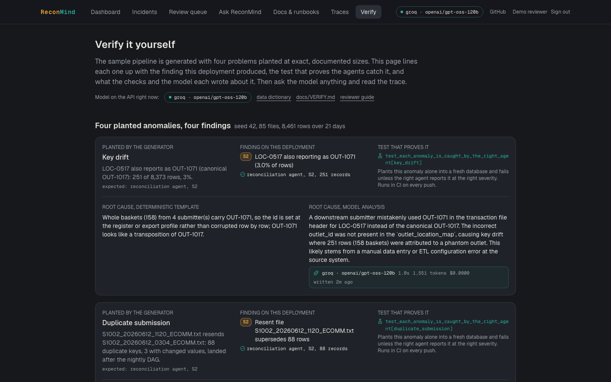 |
<!-- /evidence:screens -->

---

## Contents

- [Try it in five minutes](#try-it-in-five-minutes) · [Core concepts](#core-concepts) · [How it works](#how-it-works) · [Architecture](#architecture) · [Tech stack](#tech-stack)
- [Results](#results) · [Screens](#screens) · [What a run looks like](#what-a-run-looks-like) · [Example incident report](#example-incident-report) · [Why it is built this way](#why-it-is-built-this-way)
- [Production readiness](#production-readiness) · [Scope and limitations](#scope-and-limitations) · [Reusability and roadmap](#reusability-and-roadmap)
- [Quick start](#quick-start) · [Runbook](#runbook-walk-through-the-whole-flow-locally) · [Reference](#reference) · [Repository layout](#repository-layout) · [Development and testing](#development-and-testing) · [Documentation](#documentation) · [License](#license)

## What a run looks like

<!-- evidence:trace -->
An excerpt from the trace of one captured run, the question *Did the MOBILE file have a schema problem on 2026-06-16?*, answered in 2.8 s by `groq/openai/gpt-oss-120b`:

```
run 0c4e7eea  "Did the MOBILE file have a schema problem on 2026-06-16?"  completed

planner       llm   planner   groq/openai/gpt-oss-120b   1,056 ms   481 + 124 tokens   $0
              -> intent: investigate, specialists: ['data_quality'], confidence: 0.85
                 rationale: The question asks whether the MOBILE file had a schema problem on a
                 specific date, which is a schema_drift issue handled by the data_quality
                 specialist.
planner       tool  orchestration-metadata/list_dag_runs   212 ms   {"dag_id": "retail_txn_daily"}
data_quality  tool  orchestration-metadata/get_failed_tasks   193 ms
              <- {"since": "2026-06-09"}
              -> validate_schema failed on 2026-06-16: ContractViolation:
                 S1003_20260616_0216_MOBILE.txt missing ['channel_basket_id']; unexpected
                 ['basket_ref']
data_quality  tool  get_dbt_manifest, get_table_stats, get_timing_history: 11 calls, 204-396 ms each
data_quality  (no write-up call: the finding already had one from the scan, so it was reused)
reporter      llm   reporter:summary   groq/openai/gpt-oss-120b   593 ms   382 + 202 tokens   $0
              -> S1: 82 rows missing channel_basket_id, dedup blocked
```

The full trace, 19 steps with every input and output, is [`docs/evidence/ask-mobile-run.json`](docs/evidence/ask-mobile-run.json).
<!-- /evidence:trace -->

<!-- evidence:schema -->
<details>
<summary>The report contract: every report is validated against this Pydantic model before it is stored</summary>

From [`app/agents/schemas.py`](https://github.com/rahulramachandran-labs/reconmind/blob/1bf31accf5405378d0664355fed17ce8d0a0f096/app/agents/schemas.py#L53-L88):

```python
class IncidentReport(BaseModel):
    """What a person reads: modelled on a change request, not an agent transcript."""

    id: UUID
    run_id: UUID
    finding_type: str
    specialist: str
    severity: Severity
    title: str
    problem_statement: str
    affected_records: AffectedRecords
    root_cause_hypothesis: str
    recommended_fix: list[str]
    confidence: float = Field(ge=0.0, le=1.0)
    confidence_label: Literal["low", "medium", "high"]
    open_questions: list[str]
    evidence: list[Evidence]
    sources: list[SourceRef]
    analysis_by: str
    needs_review: bool
    review_reason: str | None = None
    trace_url: str | None = None
    status: Literal["pending_review", "published", "rejected"] = "published"
    review_note: str | None = None
    seen_count: int = 1
    repeat: bool = Field(
        default=False, description="Already reported by an earlier scan; not written up again"
    )
    # both versions are kept so a reader can compare them; the fields above show the model's
    # when there is one ("model" in analysis_by), otherwise the template's
    template: WriteUp | None = None
    model_analysis: ModelWriteUp | None = None

    @property
    def fingerprint(self) -> str:
        return fingerprint(self.finding_type, self.title)
```

</details>
<!-- /evidence:schema -->

## Example incident report

<!-- evidence:report -->
The key-drift report from the captured scan, exactly as the API returned it:

> **Problem.** Location LOC-0517 is reporting sales under two outlet ids: its canonical OUT-1017 and OUT-1071, which outlet_location_map does not map to it. 251 of 8373 deduplicated rows (3.0%) between 2026-06-01 and 2026-06-21 are affected, so store-level numbers for this location are split.
>
> **Affected records.** 251 records (3.0%) · **Severity** S2 · **Status** published
>
> **Root-cause hypothesis.** The source system that uploads transaction files for location LOC-0517 emitted an incorrect outlet_id (OUT-1071) in the header for a subset of rows. Because OUT-1071 is not present in the authoritative outlet_location_map (canonical OUT-1017), the transactions were ingested with a drifted key, causing key‑drift between location_id and outlet_id for 251 rows (0.03% of the window). This is a classic source‑header mismatch rather than a processing bug, as the raw layer is immutable and the drift was only detected by the deterministic key‑drift detection query.
>
> **Recommended fix.** 1. Contact the four submitters who sent the files between 2026-06-01 and 2026-06-21 and confirm which outlet_id (OUT-1017 or OUT-1071) is correct for LOC-0517. 2. Add OUT-1071 as an alias for OUT-1017 in the outlet_alias table with appropriate valid_from / valid_to dates so the staging model can remap the drifted rows. 3. Trigger a backfill of stg_transactions and fct_daily_sales for the affected dates (2026-06-01 to 2026-06-21) following the backfill runbook. 4. Instruct the source team to correct the outlet_id in the file header for future uploads and record the ticket number in this incident write‑up. 5. Run the detection query (see runbook section “Detection”) after the backfill to verify that no rows now show multiple outlet_ids for LOC-0517. 6. Update monitoring alerts to flag any future occurrence of multiple outlet_ids for a single location within the same business day.
>
> **Confidence.** 0.75 (high)
>
> **Open questions.** Were there any recent changes to the source system’s mapping logic or file generation process around 2026-06-01? Is OUT-1071 used legitimately for any other location, or is it a stray identifier? What is the exact process the four submitters follow to generate the header – could manual entry be a factor? Do any other locations show similar drift patterns in the same window that were not flagged due to a lower row count?
>
> **Evidence.** `mcp:warehouse-metadata/run_check`: 251 deduplicated rows (158 baskets) at LOC-0517 carry OUT-1071, which outlet_location_map does not map there; canonical is OUT-1017
>
> **Runbooks consulted.** Key drift between outlet_id and location_id: *Why it matters*, *Fix*, *Overview*, *Detection*

Run `9bda1e0c-4add-4ac7-8351-8434ccba88aa`, captured 2026-09-23 06:10:12 UTC · `analysis_by: model` · written by `openai/gpt-oss-120b` (groq) in 8,842 ms (1,205 prompt + 557 completion tokens, $0.00). The problem statement and counts come from the deterministic check; the root cause, fix, confidence and open questions are the model's, with confidence capped at the template's 0.60 plus 0.15. The template's own version is stored beside it, and its hypothesis reads: *"Whole baskets (158) from 4 submitter(s) carry OUT-1071, so the id is set at the register or export profile rather than corrupted row by row; OUT-1071 looks like a transposition of OUT-1017."* Raw JSON: [`docs/evidence/incident-key-drift.json`](docs/evidence/incident-key-drift.json).
<!-- /evidence:report -->

## Why it is built this way

- Facts come from checks, and models only write the words. The counts, severities and evidence are measured, so no model can change them, and the grounding check keeps a model from slipping in numbers of its own. It all still works with no model at all, at no cost.
- I split the work across narrow agents because my first version was one agent with every job, and when it got something wrong I couldn't tell which part had failed. Here each agent has one job and its own place in the trace.
- Pipelines are full of identifiers, and embeddings blur `channel_basket_id` and `basket_ref` where BM25 matches them exactly. Fusing the two and reranking raised context precision from 0.66 (dense only) to 0.83.
- Anything serious waits for a person. S1s and low-confidence findings stop, and the decision goes on the record.
- The model only chooses its own tools where that's safe: questions no check covers, three read-only calls at most, each one traced ([ADR 0013](docs/adr/0013-bounded-tool-use-for-open-questions.md)).
- Every retail rule sits behind a `DomainAdapter`, and a second, small domain (support-ticket triage) runs on the same agent graph in every CI run, so the reuse is tested, not just claimed.

## Production readiness

| Area | In place | Next step |
|---|---|---|
| **Authentication** | Anyone can read. Scans and review decisions need a signed-in reviewer: Auth.js with GitHub OAuth and an allow-list, or a shared demo reviewer on the public demo. The web server forwards writes with a bearer token (`WRITE_TOKEN`, compared in constant time), so the browser never sees it. Reviewer names go into the audit ledger. There are per-client rate limits and a CORS allow-list. | Roles (viewer, reviewer, admin), OIDC single sign-on, per-user tokens |
| **Storage** | Postgres 16 through SQLAlchemy 2 and versioned Alembic migrations. The audit ledger is append-only, enforced by a database trigger. Vectors live in FAISS in memory or in managed Pinecone, switched with one setting (`VECTOR_STORE`). The Docker image runs the embedding model on ONNX to fit in 512 MB. | Managed Postgres with backups (the free demo database expires after 30 days) |
| **Knowledge retrieval** | Live facts are fetched through MCP tools at the moment of each investigation, never from a stale copy. Documents are indexed with BM25 and embeddings, fused, then reranked. The index is fingerprinted and rebuilt automatically when documents change, and `CORPUS_DIR` points it at any folder of markdown. | Ingest from a wiki or docs repo on change; add approved incident reports to the corpus as new precedents |
| **State management** | LangGraph checkpoints every step in Postgres, so a run paused for review survives restarts and resumes on whichever API instance receives the decision. Runs, reports, decisions and chat memory are in Postgres too, and fingerprints make repeated scans idempotent — in the store, and again in the web app, which folds by the same fingerprint before rendering so a finding is never listed or counted twice. Only rate-limit counters, the provider cooldown and the FAISS copy are per instance. | Redis for global rate limits; Pinecone to share one index |
| **Reliability and cost** | Model fallback chain: OpenAI → Anthropic → the free tiers of Groq, Gemini and OpenRouter → local Ollama → extractive answers, with a cooldown for failing providers. Outputs are validated by Pydantic and a grounding check, retried, then fall back to a template. `DEMO_MODE` guarantees $0. A chaos suite and a 30-second latency budget run in CI. | Queue-backed scans for long windows |
| **Observability** | Every agent step, tool call, retrieval and model call is stored with latency, tokens and cost, and mirrored to LangFuse when its keys are set. A model call outside a traced run raises an error instead of going unrecorded. Logs are JSON. | Alerts on failed or slow runs |
| **Security** | Retrieved text is treated as untrusted: it is delimited, tag-sanitised and covered by a planted prompt-injection test. MCP tools are read-only with validated arguments. Secrets come only from the environment, gitleaks runs in pre-commit and in CI over the full history, and the container runs as non-root. | Secret manager instead of env vars |

## Scope and limitations

- The hosted demo writes with Groq's free tier, which allows about 8,000 tokens a minute. A burst of scans and questions can run past it; calls then fall through to the next provider and, last, to the template, and every report says which wrote it.
- The hosted API sleeps after 15 idle minutes, and the first request after that takes up to a minute. It also runs without the reranker to fit in 512 MB, so its search rankings differ a little from the local ones shown here.
- The demo's free Postgres expires around 2026-10-19. Applying the Render blueprint again recreates it, and the **Reseed the demo** workflow reloads the sample, scans and writes the findings up again ([docs/DEPLOYMENT.md](docs/DEPLOYMENT.md)).
- With no model key at all, nothing breaks: the write-ups come from the domain's templates and the answers are extractive, and every report and every answer says which wrote it.

## Reusability and roadmap

The agents never import a business rule, so a second domain is an adapter and a corpus, and one ships with the project. These are the things I would build next:

- Scans run on a schedule rather than when data lands; triggering them from the loader, or a Kafka topic, is the obvious next step.
- The Reporter proposes fixes but never applies them. Opening a pull request with the fix, gated on approval, would close that loop.
- Confidence thresholds are set by hand, and the approve and reject history is already in the ledger to tune them from.
- It runs one domain at a time; an adapter registry and multi-tenant auth would let several run side by side.

## Quick start

**Online:** follow [Try it in five minutes](#try-it-in-five-minutes) at the top.

**On your machine:** you need Python 3.12 with [uv](https://docs.astral.sh/uv/), Node 20+ and Docker. [Ollama](https://ollama.com) is optional.

```bash
git clone https://github.com/rahulramachandran-labs/reconmind && cd reconmind
make bootstrap   # Python and Node dependencies, git hooks, .env and frontend/.env.local
make dev         # Postgres, migrations and sample data, then the API on :8000 and the web app on :3000
```

To have a model write the explanations, put a free Groq key in `.env` as `GROQ_API_KEY` ([console.groq.com/keys](https://console.groq.com/keys)); that's what the hosted demo and the captured evidence use. A Gemini or OpenRouter key, a paid OpenAI or Anthropic key, or a local `ollama pull qwen2.5:1.5b` work too. With no key at all everything still runs, with explanations from templates and answers from the runbooks. Every setting is explained in [`.env.example`](.env.example).

## Runbook: walk through the whole flow locally

After `make dev`, these steps follow one run from raw data to a signed-off incident. Each step says what to do, what you should see, and where it happens in the code.

**1. Check that everything is up.**
```bash
curl -s localhost:8000/healthz
```
Expect `"status":"ok"`, `"database":true` and `"chunks":86`, the indexed runbooks, schema docs, dbt models and past incidents. *Code:* [`app/main.py`](app/main.py) builds every service at startup.

**2. See the data and the problems planted in it.** Open [localhost:3000](http://localhost:3000). The chart shows 14 days of volume, and 2026-06-18 is visibly short. The seeded generator wrote 85 files (8,461 rows); [`data/DATA_DICTIONARY.md`](data/DATA_DICTIONARY.md) describes them and [`expected_anomalies.json`](data/sample/expected_anomalies.json) lists the exact size of each planted problem. *Code:* [`app/pipeline/`](app/pipeline).

**3. Try retrieval on its own.**
```bash
curl -s "localhost:8000/search?q=basket_ref%20ContractViolation&k=3"
```
The schema-drift runbook and incident INC-0438 come back on top. Each hit shows its BM25 rank and dense rank; the incident is only 10th on meaning alone but 1st on keywords. The **Docs & runbooks** page lets you switch between the modes. *Code:* [`app/retrieval/`](app/retrieval).

**4. Ask a runbook question: RAG without the agents.**
```bash
curl -s localhost:8000/ask -H 'content-type: application/json' \
  -d '{"question": "which file wins when a submitter resends the same day?"}'
```
The answer cites passages as `[1]`, and `provider` says who wrote it (`extractive` when no model is configured). *Code:* [`app/rag/`](app/rag).

**5. Run a scan: the multi-agent flow.** On the dashboard, sign in as the demo reviewer and click **Run a scan**, or `curl -s -X POST localhost:8000/scan`. Four findings appear (one S1, three S2) and the run is **paused** for review. Without a model this takes a few seconds; a local model writing the explanations adds a minute or so. The order it happens in: [`planner.py`](app/agents/planner.py) → [`specialists.py`](app/agents/specialists.py) (both at once) → the checks in [`retail_recon/checks.py`](app/domain/retail_recon/checks.py), calling the tools in [`mcp_servers/`](mcp_servers) → [`reporter.py`](app/agents/reporter.py) → [`review.py`](app/agents/review.py). [`graph.py`](app/agents/graph.py) wires them together.

**6. Read a report.** Open **Incidents** and expand the key-drift finding: problem, affected records, root cause, fix steps, confidence, open questions, evidence and the runbooks consulted. The API equivalent is `curl -s localhost:8000/incidents`.

**7. Be the human in the loop.** Open **Review queue**, add a note, then click **Approve with note**. The paused run resumes from its checkpoint and finishes. The decision is in the audit ledger, which can't be edited:
```bash
docker compose exec postgres psql -U reconmind -c \
  "select actor, action, subject from audit_ledger order by id desc limit 3"
docker compose exec postgres psql -U reconmind -c \
  "update audit_ledger set action = 'x' where id = 1"   # ERROR: audit_ledger is append-only
```

**8. Open the trace.** Open **Traces**, then the scan. You'll see 5 agent nodes, 30 MCP tool calls, 4 retrievals and any model calls, each with its input, output and latency. `curl -s localhost:8000/runs/<run_id>` returns the same. *Code:* [`app/observability/tracer.py`](app/observability/tracer.py).

**9. Scan again.** The run summary lists the same four findings as *already reported, still there*, with none new and nothing added to the review queue. Findings are fingerprinted (`finding_type:title`), so repeated scans don't pile up duplicates. The web app folds by that same fingerprint before it renders, so a finding shows once in the feed, once in the review queue and once in the dashboard count even if the API it is talking to is still serving older copies.

**10. Ask a question that needs an investigation.** In **Ask ReconMind**, try *Did the MOBILE file have a schema problem on 2026-06-16?* The Planner sends only the Data-Quality agent, and the steps stream in as they happen. Then try a fact no check covers, *Show me which submitter sent the fewest rows on 2026-06-18, and when its file landed*: the Planner sends it to the Explorer, and the trace shows which tools the model chose. `curl -N localhost:8000/chat/stream -H 'content-type: application/json' -d '{"question": "..."}'` shows the raw server-sent events.

**11. Break it yourself.**
```bash
uv run pytest -m chaos -v    # plants each anomaly with the generator; checks the right agent catches it
uv run python scripts/generate_synthetic_pipeline.py --seed 7 --out /tmp/p --only key_drift   # a fresh dataset with one planted problem
```

**12. Run the quality gates.** `make test` runs 172 tests at 93% coverage. `make eval` scores retrieval and answers on the 46-question golden set and fails below the thresholds.

## Reference

<details>
<summary><b>Deploy</b></summary>

The API runs on Render as a Docker web service with a free Postgres, both declared in [`render.yaml`](render.yaml); the web app runs on Vercel from [`frontend/`](frontend), and forwards writes to the API with a bearer token that never reaches the browser. Scheduled scans, the keep-alive and the reseed are GitHub Actions workflows in [`.github/workflows/`](.github/workflows). Every step, and the environment each side needs: [docs/DEPLOYMENT.md](docs/DEPLOYMENT.md).

</details>

<details>
<summary><b>API</b></summary>

FastAPI, with interactive docs at `/docs` on any running instance ([live](https://reconmind-labs-api.onrender.com/docs)). Reads are open; the calls marked *writer* need a bearer token.

| | |
|---|---|
| Agents and review | `POST /chat/stream` · `POST /scan` *writer* · `GET /runs`, `/runs/{id}` · `GET /incidents`, `/incidents/{id}` · `POST /incidents/{id}/regenerate` *writer* · `POST /incidents/{id}/reopen` *writer* · `GET /review` · `POST /review/reports/{id}` *writer* · `POST /review/runs/{id}` *writer* · `GET /dashboard` |
| Retrieval on its own | `POST /ask` · `GET /search` · `GET /corpus`, `/corpus/{doc_id}` · `GET /sessions/{id}/messages` |
| Status | `GET /healthz` · `GET /model` |

Every endpoint, and the chat stream's event types: [docs/API.md](docs/API.md).

</details>

<details>
<summary><b>Configuration</b></summary>

Every setting comes from the environment, and [`.env.example`](.env.example) explains each one in seven groups: basics, database, language models, knowledge retrieval, agents, tracing, and security and limits. Nothing in it is required: with no database it keeps runs and reports in memory, and with no model key the write-ups come from templates and the answers are extractive. The web app has its own, much shorter [`frontend/.env.example`](frontend/.env.example).

</details>

## Repository layout

```
app/                     the backend (Python, FastAPI)
  main.py                entry point: builds the shared services, mounts the API routers
  core/                  settings from the environment (config.py) and JSON logging
  api/                   HTTP routes: agents and review, ask/search/corpus, dashboard, health; auth and rate limits
  agents/                the multi-agent system (LangGraph)
    graph.py               wiring: Planner → specialists (parallel) → Reporter → human review
    planner.py             Planner agent: answer from runbooks, or which specialists investigate
    specialists.py         specialist agents: run the domain's checks, then explain each finding
    reporter.py            Reporter agent: incident reports, run summary, who needs sign-off
    answerer.py            answers runbook questions with citations
    review.py              human-in-the-loop checkpoints (LangGraph interrupt)
    service.py             runs and resumes the graph, streams events to the API
    store/                 runs, reports and decisions: Postgres (sql.py) or in memory (memory.py)
    deps.py, schemas.py    what every node receives; Pydantic models for plans and reports
    bootstrap.py           assembles all of the above from settings
    scheduler.py           optional in-process scan timer
  domain/                business rules behind the DomainAdapter protocol
    protocol.py            the contract the agents code against
    retail_recon/          rules.py (keys, thresholds), checks.py, writeups.py (rubric, wording), adapter.py
    example_support_triage/  a second domain proving the agents are generic
  llm/                   model access: fallback chain and pricing, traced client, structured output
  rag/                   prompts and passage formatting, cited answers, extractive fallback
  retrieval/             corpus loading, chunking, embeddings, BM25, FAISS / Pinecone, fusion, reranking
  tools/                 MCP client the agents call tools through
  observability/         per-run tracer: Postgres, mirrored to LangFuse
  memory/                chat session memory
  db/                    SQLAlchemy models and engine
  pipeline/              synthetic data generator, dbt artifacts, loader
mcp_servers/             two read-only MCP servers: warehouse-metadata, orchestration-metadata
corpus/                  knowledge base: runbooks, schema docs, past incident write-ups (synthetic)
data/  dbt/              the seeded sample and data dictionary; dbt model YAML and manifest
evals/                   golden set, RAGAS runner, thresholds, score history
frontend/                Next.js web app (App Router, shadcn/ui, Auth.js)
migrations/              Alembic migrations, including the append-only ledger trigger
tests/                   unit, integration (Postgres, MCP, agents, prompt injection), chaos
docs/                    architecture, API, deployment, evaluation, ADRs, deck, demo script,
                         the walkthrough, captured evidence and screenshots
scripts/                 data generator CLI, container entrypoint, demo recording and screenshots,
                         evidence capture for the README
```

To read the code in the order a run executes: [`graph.py`](app/agents/graph.py) → [`planner.py`](app/agents/planner.py) → [`specialists.py`](app/agents/specialists.py) → [`retail_recon/checks.py`](app/domain/retail_recon/checks.py) → [`reporter.py`](app/agents/reporter.py) → [`review.py`](app/agents/review.py).

## Development and testing

CI runs ruff, black and mypy, then the whole suite with an 80% coverage gate, including Postgres, MCP, agent, prompt-injection and chaos tests. It finishes with gitleaks, a production build of the web app and a fresh-clone run of `make bootstrap && make dev`. Make targets, docker compose and the conventions I follow are in [docs/DEVELOPMENT.md](docs/DEVELOPMENT.md); the quality bar and the judges are in [docs/EVALUATION.md](docs/EVALUATION.md).

<!-- evidence:testing -->
From the last captured run of `make test` ([`docs/evidence/tests.txt`](docs/evidence/tests.txt)): 172 passed, 0 failed, 92.58% coverage.

| Layer | Tests | What it covers |
|---|---|---|
| Unit | 112 | Retrieval (tokenizer, RRF, reranker), the model fallback chain, structured output, prompts, tracing, the synthetic generator, rate limits |
| Integration | 54 | Postgres and the append-only ledger, both MCP servers through a real client, the agent graph end to end, the API |
| of which prompt injection | 1 | A runbook carrying planted instructions can't change a severity or approve anything ([test](tests/integration/test_prompt_injection.py)) |
| of which domain-agnostic proof | 2 | The same graph runs on the support-triage domain, and no agent module imports a domain ([test](tests/integration/test_domain_agnostic.py)) |
| Chaos | 6 | Each anomaly planted on its own is caught by the right agent at the right severity, a clean pipeline raises nothing, and a scan fits the 30-second budget ([tests](tests/chaos/test_injected_anomalies.py)) |
<!-- /evidence:testing -->

## Documentation

| Document | What's in it |
|---|---|
| [Architecture](docs/ARCHITECTURE.md) | Components, the agent graph, MCP tools, retrieval pipeline, data model, domain adapters |
| [API reference](docs/API.md) | Every endpoint and the chat stream's event types |
| [Deployment](docs/DEPLOYMENT.md) | Render and Vercel setup, scheduled scans, free-tier notes |
| [Evaluation](docs/EVALUATION.md) | Golden set, judges, scores, the quality bar |
| [Development](docs/DEVELOPMENT.md) | Make targets, docker compose, tests, conventions |
| [Configuration](.env.example) | Every environment variable, explained ([web app](frontend/.env.example)) |
| [Verify it yourself](docs/VERIFY.md) | Each planted anomaly, the finding it produced, the test that proves it, both write-ups |
| [Course mapping](docs/COURSE_MAPPING.md) | Each course module, the code and lines that show it, and the test that covers it |
| [Decision records](docs/adr/README.md) | Why LangGraph, why MCP, why hybrid search, and the rest |
| [Getting around ReconMind](docs/GUIDE.md) | A walkthrough of the live app and a local run, with where to check each claim |
| [Captured evidence](docs/evidence/README.md) | The raw API responses and test output behind this README's numbers |

## License

[MIT](LICENSE) · Rahul Ramachandran
