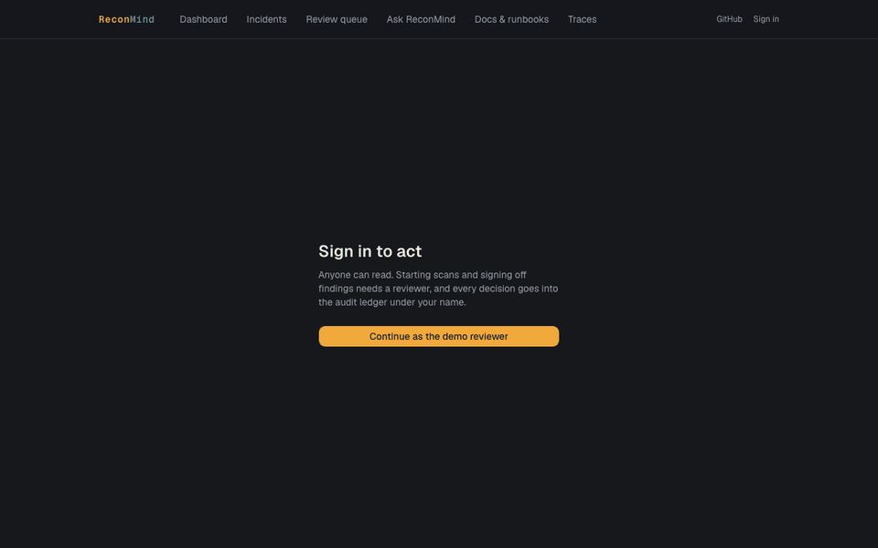
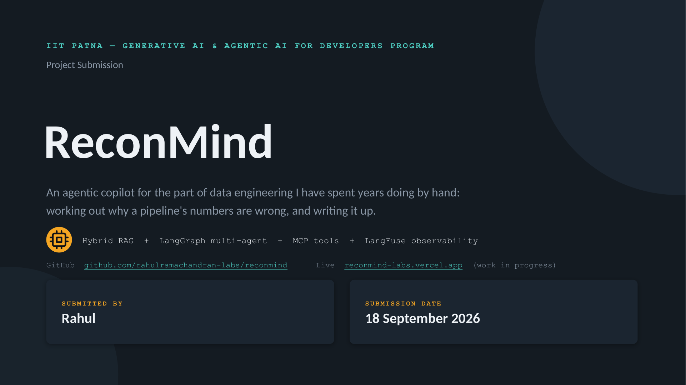
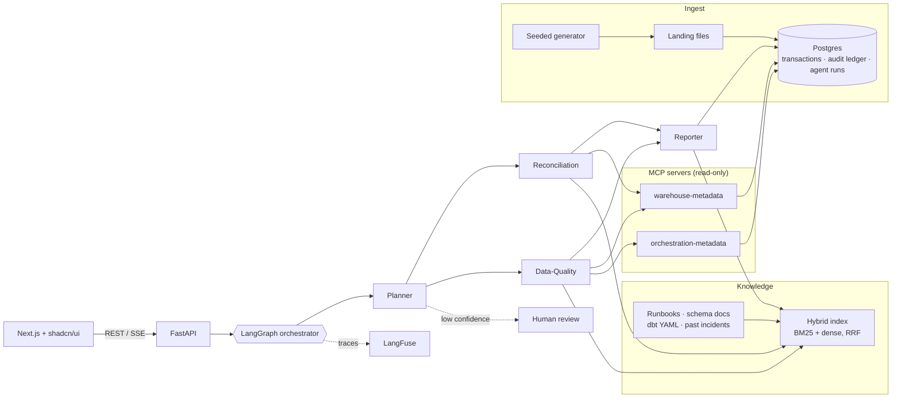

# ReconMind

[](https://github.com/rahulramachandran-labs/reconmind/actions/workflows/ci.yml)
[](LICENSE)
[](pyproject.toml)
[](frontend/package.json)

**An agentic copilot for the part of data engineering I have spent years doing by hand: working out why a pipeline's numbers are wrong, and writing it up.**

ReconMind is a multi-agent, RAG-powered copilot that watches a synthetic data pipeline for key-mismatch, dedup, and schema-drift incidents, investigates them the way a senior data engineer would, and produces an incident write-up a human can act on. It is production RAG plus agentic orchestration applied to real data-engineering problems, not generic document Q&A.

| | |
|---|---|
| **Program** | Final project, IIT Patna Generative AI & Agentic AI for Developers program |
| **Author** | Rahul Ramachandran |
| **Live app** | [reconmind-labs.vercel.app](https://reconmind-labs.vercel.app) |
| **API** | [reconmind-labs-api.onrender.com](https://reconmind-labs-api.onrender.com/healthz), deployed from [`render.yaml`](render.yaml) (free tier: the first request after idle takes up to a minute) |
| **Project deck** | [PDF](docs/slides/Rahul_Ramachandran_ReconMind-ProjectSubmission.pdf) · [PPTX](docs/slides/Rahul_Ramachandran_ReconMind-ProjectSubmission.pptx) |
| **60-second demo** | [docs/DEMO.md](docs/DEMO.md) |
| **Write-up** | [docs/blog/reconmind-writeup.md](docs/blog/reconmind-writeup.md) |



[](docs/slides/Rahul_Ramachandran_ReconMind-ProjectSubmission.pdf)

---

## Contents

**About the project:** [Overview](#overview) · [The problem](#the-problem) · [Objectives](#objectives) · [The solution](#the-solution) · [Key features](#key-features) · [Application screens](#application-screens) · [What an incident report looks like](#what-an-incident-report-looks-like) · [Course concepts applied](#course-concepts-applied) · [Scope and constraints](#scope-and-constraints) · [Challenges and learnings](#challenges-and-learnings) · [Reusability and future work](#reusability-and-future-work)

**Technical details:** [Architecture](#architecture) · [Tech stack](#tech-stack) · [Quick start](#quick-start) · [Deploy](#deploy) · [Synthetic data](#synthetic-data) · [Retrieval and evaluation](#retrieval-and-evaluation) · [API](#api) · [Configuration](#configuration) · [Repository layout](#repository-layout) · [Development](#development)

---

# About the project

## Overview

Data teams that ingest files from many sources spend a surprising amount of senior time on the same investigation loop: a number looks wrong, someone checks the raw tables, the orchestrator logs, the dbt contracts and the runbooks, finds the cause, and writes it up for whoever has to fix it. The reasoning is valuable, but it lives in people's heads and chat threads.

ReconMind automates that loop. It watches a pipeline on a schedule, or answers questions whenever you ask. It sends specialist agents to gather evidence from live pipeline metadata and from the team's own runbooks and past incidents, and hands you a structured incident report with record counts, a likely root cause, a recommended fix and how confident it is. When it isn't sure, it stops and asks a person instead of guessing.

Everything runs on a seeded synthetic dataset that mirrors the shape of real reconciliation problems. No real company, schema or business logic is referenced anywhere.

## The problem

Four failures keep showing up in multi-source pipelines:

| Failure mode | What it looks like | Why it hurts |
|---|---|---|
| **Key drift** | Same store, two ids: one location reports under two `outlet_id`s | The join quietly splits the store in two; a "new" store appears with no history |
| **Duplicate submissions** | A vendor resends a file, so the same transaction is in twice | Revenue is double counted unless "latest file wins", a rule that often exists only in someone's head |
| **Schema drift** | Upstream renames a column on a Friday | Downstream finds out on Monday; dedup silently stops working for that batch |
| **Volume anomalies** | A feed comes in 40% light | Nobody notices until a dashboard looks off and someone asks why |

What usually gets tried, and why it isn't enough:

- **Dashboards** tell you something is off, but not why.
- **A chatbot over the runbooks** can explain an error, but it can't go and look at the pipeline.
- **One big agent** with every job in its prompt is impossible to debug. When it fails, you can't tell which part failed.

## Objectives

1. Catch all four failure types on a schedule, or whenever a user asks a question.
2. Investigate with specialist agents that read live pipeline metadata through tools, not hardcoded API clients.
3. Ground every conclusion in the runbooks, schema docs and old incident write-ups an engineer would normally pull up.
4. Produce a structured incident report: what broke, how many records, the likely root cause, a suggested fix.
5. When not sure, stop and ask a human instead of guessing.
6. Trace every LLM and tool call so any answer can be audited after the fact.
7. Keep the agents domain-agnostic so the same system can be pointed at a different problem.

## The solution

A question or a scheduled scan enters an agent graph. The **Planner** decides who needs to look. Two specialists work in parallel:

- **Reconciliation** applies the dedup keys and the latest-file-wins rule, and flags key drift.
- **Data-Quality** diffs the live schema against the dbt contract and checks volume and timing against the orchestrator's run history.

Both gather evidence through read-only **MCP** tool servers and retrieve relevant runbooks and past incidents through **hybrid search**. The **Reporter** turns their findings into a validated incident report. If the Planner's confidence is low, the graph pauses in a **review queue** until a person approves, rejects or annotates it. **LangFuse** keeps the record of how every answer was reached.

## Key features

- **Grounded answers with citations.** Hybrid retrieval (BM25 + dense embeddings, fused with reciprocal rank fusion) over runbooks, schema docs, dbt models and past incidents. Every claim links to its source passage.
- **Four specialist agents** on LangGraph, with Pydantic-validated outputs and a capped retry loop instead of free-form text.
- **Live pipeline evidence through MCP.** Two read-only tool servers expose the warehouse metadata (schema, dbt manifest, table stats) and the orchestrator metadata (DAG runs, task logs, timings).
- **Human in the loop.** Low-confidence findings pause in a review queue; the graph resumes once someone approves, rejects or annotates them.
- **Full audit trail.** An append-only ledger in Postgres (enforced by a database trigger) plus LangFuse traces for every agent step, tool call, prompt version, latency and token cost.
- **Zero-cost demo mode.** A provider fallback chain (OpenAI, then Anthropic, then local Ollama) with `DEMO_MODE` to skip paid providers. If no model is available at all, the system still answers with the most relevant passages and citations.
- **Measured quality.** A 46-question golden set scored with RAGAS on every push; CI fails if quality drops below the thresholds.
- **Reproducible data.** A seeded generator plants the four failure types with exact, documented sizes, so tests assert on counts rather than on "something was found".

## Application screens

| Screen | What it does |
|---|---|
| **Dashboard** | Today's volume vs trailing average, open findings by severity, last DAG run, today's token cost |
| **Incident feed** | Every finding, expandable into the full write-up, with a link to its LangFuse trace |
| **Review queue** | Findings the graph paused on; approve, reject or annotate and the graph picks back up |
| **Ask ReconMind** | Streaming chat with session memory in Postgres; every answer cites its sources and shows which model answered |
| **Docs & runbooks** | The ingested corpus, searchable on its own, with hybrid / dense / BM25 side by side, so retrieval can be checked before the agents touch it |
| **Traces** | Recent agent runs with cost and latency, linking into LangFuse |

## What an incident report looks like

The Reporter's output follows a change-request format rather than a raw agent dump. This is the target shape, filled in with the key-drift anomaly planted in the synthetic data:

> **Problem.** Location `LOC-0517` is reporting sales under two outlet ids, its canonical `OUT-1017` and `OUT-1071`, which is not in `outlet_location_map`.
>
> **Affected records.** 251 rows over 21 business days, 3.0% of deduplicated rows. Severity **S2** (drift above 2%).
>
> **Root-cause hypothesis.** A transposed outlet id in a register export profile, the same pattern as INC-0412. Whole baskets drift together, which points at register configuration rather than row-level corruption.
>
> **Recommended fix.** Confirm the correct id with the submitter, add `OUT-1071 → OUT-1017` to `outlet_alias` for the window, and rebuild `stg_transactions` and `fct_daily_sales`. Do not edit raw rows.
>
> **Confidence.** Medium: the detection is certain, the cause is inferred from a past incident.
>
> **Open questions.** Which registers carry the wrong profile? Did the drift start on 2026-06-01 or earlier?
>
> **Evidence.** Key-drift runbook (detection, fix), INC-0412 write-up, `outlet_location_map`, LangFuse trace link.

## Course concepts applied

| Module | Concept | How it is used here |
|---|---|---|
| GenAI foundations | Prompting, structured output, context windows | Agent prompts with delimited, untrusted context; Pydantic-validated outputs with a retry loop |
| Models & APIs | Provider abstraction, fallback, cost awareness | OpenAI → Anthropic → Ollama fallback chain; provider and token cost logged per call |
| LangChain | Loaders, splitters, retrievers, memory | Markdown and dbt YAML ingestion, section-aware splitting, a LangChain hybrid retriever, session memory in Postgres |
| RAG systems | Chunking, BM25 + dense hybrid, RRF, RAGAS | Hybrid retriever over FAISS / Pinecone; golden set with a RAGAS gate in CI |
| Agentic AI | LangGraph StateGraph, conditional edges, checkpoints, multi-agent | Planner → Reconciliation ∥ Data-Quality → Reporter; human-in-the-loop checkpoint |
| MCP | Host / client / server, JSON-RPC lifecycle, stdio vs HTTP | Two read-only MCP servers: warehouse-metadata and orchestration-metadata |
| Observability & deployment | LangFuse tracing, FastAPI, Docker, Vercel / Render | Every step traced; containerized stack; public deployment with CI |

## Scope and constraints

- **Synthetic data only.** A seeded generator mimics the shape of real reconciliation problems; nothing from any employer or client.
- **Zero-cost demo.** Local Ollama and sentence-transformers behind the provider fallback chain.
- **Solo build, in phases,** with tests gating each phase before the next starts.
- **Not in scope:** streaming ingestion, multi-tenant auth, production SLAs.

## Challenges and learnings

- **One agent vs many.** The first sketch was one agent with every job. The prompt was enormous, and when it failed I couldn't tell which part had failed. Four narrow agents fixed both problems.
- **Embeddings blur identifiers.** Dense search kept confusing tables and columns with similar names. Adding BM25 and fusing with RRF fixed the exact-match questions without losing the conceptual ones. For example, "basket_ref ContractViolation" finds the schema-drift runbook and the rename incident only with hybrid search.
- **Retrieved text is untrusted input.** Runbooks go straight into prompts. Once I thought about it that way, delimiting them and testing against a planted instruction stopped being optional.
- **Observability is the trust layer.** If I can't answer "why did it say that?" without re-running everything, I won't trust it in production. A trace link on every finding makes it auditable.
- **Reusability must be provable.** Saying it is domain-agnostic is easy. Moving every business rule into a `DomainAdapter` and booting the graph on a stub adapter in CI is what makes it true.

## Reusability and future work

Every retail rule lives in [`app/domain/retail_recon`](app/domain/retail_recon): the dedup key, the key-drift pair, schema-drift tolerance, the volume window, the severity rubric and the write-up wording. It sits behind a `DomainAdapter` protocol, and the agents import only the protocol. [`app/domain/example_support_triage`](app/domain/example_support_triage) is a second, deliberately small domain with different specialists and finding types, and a test boots the same graph on it in every CI run.

Swap the data generator and the two MCP servers, and the retrieval layer, the agent graph, the tracing and the UI shell stay exactly as they are:

- **Claims Copilot** (healthcare): claims-vs-EOB matching; coding and billing drift.
- **Support Triage Copilot** (SaaS): route tickets; check account state and known incidents; draft the response.
- **Signal Review Copilot** (trading): feed and tick anomalies; position and ledger drift across venues.

Next steps:

- Kafka ingestion so scans run when data lands, not on a timer.
- Let the Reporter open a pull request with the fix, gated on approval.
- Tune the Planner's routing threshold from the approve / reject history.
- Multi-tenant auth and an adapter registry so several domains can run side by side.

---

# Technical details

## Architecture



1. **Synthetic pipeline**: the seeded generator writes landing files, which a loader puts into Postgres with an append-only audit ledger and agent-run history.
2. **MCP servers and vector store**: schema, dbt manifest, DAG runs and the document corpus.
3. **LangGraph with four agents**: planner, specialists, reporter.
4. **LangFuse tracing**: every call, cost and prompt version.
5. **FastAPI backend**: REST and SSE streaming.
6. **Next.js frontend**: dashboard, feed, chat, docs.

## Tech stack

| Area | Tools |
|---|---|
| Frontend | Next.js (App Router), shadcn/ui, Tailwind, Vercel |
| Backend | FastAPI, SQLAlchemy + Alembic, Postgres, APScheduler, Render / Railway |
| Orchestration | LangGraph, LangChain, Pydantic, asyncio |
| Retrieval | BM25 (`rank_bm25`), FAISS / Pinecone, sentence-transformers, RRF |
| Tools and models | MCP (two servers), OpenAI / Anthropic, Ollama, provider fallback chain |
| Ops and quality | LangFuse, RAGAS, pytest + chaos suite, Docker Compose, GitHub Actions, gitleaks, pre-commit |

## Quick start

You need Python 3.12 with [uv](https://docs.astral.sh/uv/), Node 20+, and Docker. [Ollama](https://ollama.com) is optional; without it the API answers extractively.

```bash
git clone https://github.com/rahulramachandran-labs/reconmind && cd reconmind
make bootstrap    # uv sync, npm ci, git hooks, .env and frontend/.env.local
make dev          # postgres in docker, migrations, synthetic sample, then api on :8000 and web on :3000
```

Port 5432 already taken? Set `POSTGRES_PORT` and the port in `DATABASE_URL` in `.env`.

Or run everything in containers, including the MCP servers over HTTP, Ollama and a self-hosted LangFuse (UI on :3001, sign in as `admin@reconmind.local` / `reconmind-local`):

```bash
docker compose --profile full up --build
```

Ask something:

```bash
curl -s localhost:8000/ask -H 'content-type: application/json' \
  -d '{"question": "which file wins when a submitter resends?"}' | jq '.answer, .provider'
```

**Zero-cost demo mode.** `DEMO_MODE=true` drops the paid providers from the fallback chain, so answers come from local Ollama (`ollama pull qwen2.5:1.5b`). If no model is reachable at all, the API still returns the most relevant passages with citations and says the answer is extractive. CI and the free hosted tier both run that way.

## Deploy

The web app runs on Vercel and the API (with its Postgres) on Render; a Railway config is included as the alternative.

1. **API:** open [render.com/deploy?repo=…/reconmind](https://render.com/deploy?repo=https://github.com/rahulramachandran-labs/reconmind) and approve the blueprint in [`render.yaml`](render.yaml). It creates the service and a free Postgres, runs migrations, loads the synthetic sample, and schedules a scan every six hours. Fill in `WRITE_TOKEN` (any long random string) and, optionally, model and LangFuse keys.
2. **Web:** import `frontend/` in Vercel and set `NEXT_PUBLIC_API_URL` / `RECONMIND_API_URL` to the API URL, `RECONMIND_WRITE_TOKEN` to the same token, and `AUTH_SECRET` to a random string. `AUTH_DEMO_MODE=true` lets visitors act as a shared demo reviewer. Set it to `false`, and set `AUTH_GITHUB_ID` / `AUTH_GITHUB_SECRET` / `AUTH_ALLOWED_GITHUB_LOGINS`, for real sign-in.
3. `make deploy` redeploys the web app from the CLI; the API redeploys on every push to `main`.

Two things to know about the free tier:

- **The database expires.** Render deletes free Postgres databases 30 days after they are created. The demo's `reconmind-db` was created on 2026-09-19, so it goes around 2026-10-19. When it does, apply the blueprint again or point `DATABASE_URL` at another Postgres; migrations and the sample load run on startup either way.
- **Scheduled scans only run while the instance is awake.** `SCAN_INTERVAL_MINUTES` schedules scans inside the API process, but a free instance sleeps after 15 minutes without traffic and the timer restarts when it wakes. For scans on a real schedule, run it on a paid instance or call `POST /scan` from an external cron with the write token.

Anyone can read. Scans and review decisions go through the web app, which checks the session and forwards the call with the server-side token, so the token never reaches the browser. Chat, ask and scan are rate limited per client.

## Synthetic data

`scripts/generate_synthetic_pipeline.py` is seeded (`--seed 42` by default) and byte-for-byte reproducible. A test regenerates the committed sample and fails if a single byte differs.

It writes what a real landing zone would hold: 85 pipe-delimited submitter files over 21 business days (8,461 rows), reference data, an Airflow-style DAG run log with one failed task, dbt model YAML with a fake `manifest.json`, the [data dictionary](data/DATA_DICTIONARY.md), and [`expected_anomalies.json`](data/sample/expected_anomalies.json) with the exact size of every planted problem.

| Planted anomaly | Where | Size |
|---|---|---|
| Key drift | `LOC-0517` also reports as `OUT-1071` | 251 rows, 3.0% |
| Duplicate submission | ECOMM resends 2026-06-12 after the DAG ran | 88 keys, 3 with changed values |
| Schema drift | MOBILE 2026-06-16 renames `channel_basket_id` to `basket_ref`; `validate_schema` fails | 82 rows |
| Volume anomaly | POSFEED 2026-06-18 lands 161 minutes late | 110 rows vs 182.6 trailing (40% below) |

```bash
uv run python scripts/generate_synthetic_pipeline.py --seed 7 --out /tmp/p --only key_drift
```

## Retrieval and evaluation

Documents are chunked by markdown section, then by size, with the title and section carried into every chunk ([ADR 0001](docs/adr/0001-chunk-by-markdown-section.md)). BM25 (`rank_bm25`, with an identifier-aware tokenizer) and dense search (MiniLM on FAISS, or Pinecone behind `VECTOR_STORE=pinecone`) each return 20 candidates. Reciprocal rank fusion merges them, and a MiniLM MS MARCO cross-encoder reranks the fused top 10 (same weights on onnxruntime in the container).

[`evals/golden_set.jsonl`](evals/golden_set.jsonl) has 46 question, answer and context triples covering every anomaly type and every screen. [`evals/run_ragas.py`](evals/run_ragas.py) scores faithfulness, answer relevancy, context precision and context recall. CI fails if any metric drops below [`evals/thresholds.yaml`](evals/thresholds.yaml), and results are appended to `evals/history.csv`. Without an API key the context metrics come from RAGAS's non-LLM implementations, and faithfulness and relevancy come from cross-encoder judges. With `OPENAI_API_KEY` set, the LLM-judged RAGAS metrics run instead.

```bash
make eval                                                         # hybrid, gate + record
uv run --group eval python evals/run_ragas.py --retriever dense   # dense-only baseline
```

Latest scores (offline judge, extractive answers, k=5):

| Retriever | Faithfulness | Answer relevancy | Context precision | Context recall |
|---|---|---|---|---|
| Dense only | 0.920 | 0.863 | 0.661 | 0.844 |
| Hybrid (BM25 + dense, RRF) | 0.917 | 0.864 | 0.756 | 0.911 |
| **Hybrid + cross-encoder rerank (default)** | **0.911** | **0.862** | **0.830** | **0.922** |

The relevancy judge for the last row is the 12-layer MS MARCO cross-encoder, so the reranker (6-layer) isn't grading its own output.

Quality bar: RAGAS faithfulness ≥ 0.85, answer relevancy ≥ 0.80, context precision ≥ 0.80, context recall ≥ 0.85, every planted anomaly caught, test coverage ≥ 80%, an investigation in under 30 s in demo mode, and zero untraced LLM calls.

## API

| Method | Path | What it does |
|---|---|---|
| `POST` | `/chat/stream` | `{question, session_id?}`: runs the agent graph and streams server-sent events (`session`, `run`, `plan`, `node`, `finding`, `report`, `summary`, `answer`, `paused`, `done`) |
| `POST` | `/scan` | Starts a full scan in the background, returns the run id |
| `GET` | `/incidents`, `/incidents/{id}` | Incident reports, filterable by `status` and `severity` |
| `GET` | `/review` | Reports and plans waiting for a person |
| `POST` | `/review/reports/{id}` | `{decision: approve\|reject\|annotate, note?}`; the run resumes once every paused report in it has a decision |
| `POST` | `/review/runs/{id}` | Approve or reject a plan the Planner was unsure about |
| `GET` | `/runs`, `/runs/{id}` | Agent runs with cost and latency, and every traced step |
| `POST` | `/ask` | Retrieval and answer only, without the agents |
| `GET` | `/search?q=&mode=hybrid\|dense\|bm25` | Retrieval only, with dense and BM25 ranks per hit |
| `GET` | `/corpus`, `/corpus/{doc_id}` | The ingested documents |
| `GET` | `/sessions/{id}/messages` | Conversation history |
| `GET` | `/healthz` | Status, retriever, provider chain, database |

Interactive API docs are served at `/docs` on the API host.

## Configuration

Everything comes from environment variables (see [`.env.example`](.env.example)). None are needed for a local demo.

| Variable | Default | Notes |
|---|---|---|
| `DATABASE_URL` | unset | Postgres; without it chat sessions live in memory |
| `LLM_PROVIDERS` | `["openai","anthropic","ollama"]` | Fallback order |
| `DEMO_MODE` | `false` | Drops the paid providers |
| `OPENAI_API_KEY` / `ANTHROPIC_API_KEY` | unset | Providers without a key are skipped |
| `OLLAMA_BASE_URL` / `OLLAMA_MODEL` | `http://localhost:11434` / `qwen2.5:1.5b` | An empty base URL disables Ollama |
| `RETRIEVER` | `hybrid` | `dense` and `bm25` for comparison |
| `EMBEDDINGS_BACKEND` | `sentence-transformers` | `fastembed` (same model on ONNX, used in the container), `openai`, `hashing` (tests) |
| `VECTOR_STORE` | `faiss` | `pinecone` with `PINECONE_API_KEY` |

## Repository layout

```
app/
  agents/         LangGraph graph, planner / specialist / reporter nodes, tracing LLM wrapper,
                  structured-output loop, run store and the service behind the API
  domain/         DomainAdapter protocol, retail_recon (every business rule) and the
                  example_support_triage stub
  tools/          MCP tool box the agents call through
  observability/  per-run tracer: Postgres steps, mirrored to LangFuse
  api/            FastAPI routes, including SSE chat and review
  db/             SQLAlchemy models, engine
  pipeline/       synthetic generator, dbt project, loader, seed
  retrieval/      corpus loaders, chunking, embeddings, BM25, FAISS, Pinecone, hybrid RRF
  llm.py          provider fallback chain
mcp_servers/      warehouse-metadata and orchestration-metadata (read-only, stdio or HTTP)
corpus/           runbooks, schema docs, past incident write-ups (synthetic)
data/             seeded sample and data dictionary
dbt/              model YAML and the manifest the warehouse pretends to have
evals/            golden set, RAGAS runner, thresholds, history
frontend/         Next.js App Router + shadcn/ui
migrations/       Alembic, including the append-only ledger trigger
tests/            unit, integration (Postgres, MCP, agents), prompt injection, domain-agnostic proof
docs/             ADRs and the project deck
```

## Development

```bash
make test       # pytest with the 80% coverage gate (Postgres tests skip without a database)
make lint       # ruff, black, mypy, eslint
make eval       # RAGAS gate
uv run pytest -m chaos   # plant each anomaly with the generator and check the right agent catches it
make sync MSG="feat(scope): message"   # hooks, tests, commit, push
```

Commits follow conventional commits scoped by phase. Pre-commit runs ruff, black, mypy on changed files and gitleaks. CI runs lint, types, tests with coverage, gitleaks over full history and `next build`.

## License

[MIT](LICENSE)
