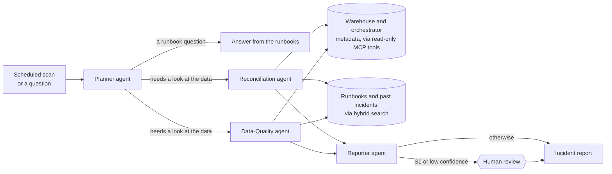

# ReconMind

[](https://github.com/rahulramachandran-labs/reconmind/actions/workflows/ci.yml)
[](LICENSE)
[](pyproject.toml)
[](frontend/package.json)

**When a data pipeline's numbers go wrong, someone has to work out why: which file, which key, how many rows, and what to do about it. ReconMind is a multi-agent AI copilot that does that investigation.** Specialist agents inspect the live pipeline through MCP tools, look up the team's runbooks and past incidents, and hand back an incident report with record counts, a likely root cause, a fix and a confidence score. Anything serious or uncertain waits for a person to sign it off.

> **Evaluate this in five minutes**
> 1. Open the [API health check](https://reconmind-labs-api.onrender.com/healthz) first: the free tier can take up to a minute to wake.
> 2. Open **[reconmind-labs.vercel.app](https://reconmind-labs.vercel.app)** and choose *Sign in* → *Continue as the demo reviewer*.
> 3. Click **Run a scan**: the dashboard counts four open findings, one of them an S1 waiting in the **Review queue**.
> 4. In **Ask ReconMind**, ask *Did the MOBILE file have a schema problem on 2026-06-16?*, then open the run on **Traces**.
> 5. Narrated version: [docs/DEMO.md](docs/DEMO.md). Full checklist: [docs/REVIEWER_GUIDE.md](docs/REVIEWER_GUIDE.md).

**[Live app](https://reconmind-labs.vercel.app)** · [2-minute demo video](docs/demo.mp4) · [Project deck (PDF)](docs/slides/Rahul_Ramachandran_ReconMind-ProjectSubmission.pdf) · [60-second demo script](docs/DEMO.md) · [Write-up](docs/blog/reconmind-writeup.md)

Final project for the IIT Patna Generative AI & Agentic AI for Developers program, by Rahul Ramachandran, submitted 18 September 2026. All data is synthetic.


---

## How it works

Four submitters send a retail pipeline a daily file each. Over 21 days of seeded, synthetic data, four things go wrong: a store starts reporting under a second id (**key drift**), a file is resent after the nightly load (**duplicate submission**), a column is renamed (**schema drift**) and one feed arrives 40% light (**volume anomaly**). This is what ReconMind does about them:



1. **Something starts a run.** A scan every six hours (GitHub Actions), a click on *Run a scan*, or a question in the chat. *Code:* [`refresh-demo.yml`](.github/workflows/refresh-demo.yml), [`app/api/`](app/api)
2. **The Planner decides who should look.** A general question ("which file wins when a submitter resends?") is answered straight from the runbooks. A question about the data ("did the MOBILE file have a schema problem on 2026-06-16?") goes to the specialist that owns it. A scan sends both. *Code:* [`app/agents/planner.py`](app/agents/planner.py)
3. **Specialists investigate in parallel.** *Reconciliation* checks for duplicate submissions and key drift; *Data-Quality* checks every file against the dbt contract and each day's volume against its trailing week. They get their facts by calling tools on two read-only **MCP servers** (a scan makes 30 tool calls), so every number is measured, not generated. *Code:* [`app/agents/specialists.py`](app/agents/specialists.py), [`app/domain/retail_recon/`](app/domain/retail_recon), [`mcp_servers/`](mcp_servers)
4. **They look up what the team already knows.** Hybrid search (BM25 + embeddings, fused, then reranked) finds the matching runbook and any past incident with the same pattern. A model, or a template when no model is configured, turns facts plus runbooks into a root cause, fix steps and a confidence score. *Code:* [`app/retrieval/`](app/retrieval), [`app/rag/`](app/rag)
5. **The Reporter writes it up and decides who signs off.** Each finding becomes a structured incident report. S1 findings and anything below the confidence threshold **pause** the LangGraph run in a review queue; a reviewer approves, rejects or annotates, and the run resumes from its Postgres checkpoint. Every decision goes into an append-only audit ledger. *Code:* [`app/agents/reporter.py`](app/agents/reporter.py), [`app/agents/review.py`](app/agents/review.py)
6. **Everything is traced.** Every agent step, tool call, retrieval and model call is stored with its latency and cost, shown on the Traces page and mirrored to LangFuse. *Code:* [`app/observability/`](app/observability)

### What a run looks like

An excerpt from the trace of one captured run, the question *Did the MOBILE file have a schema problem on 2026-06-16?*, answered in 16.6 s by `openai/gpt-oss-120b` on Groq's free tier:

```
run 08cdde6e  "Did the MOBILE file have a schema problem on 2026-06-16?"  completed

planner       llm   planner                groq/openai/gpt-oss-120b      482 ms   436 + 113 tokens   $0
              -> {"intent": "investigate", "specialists": ["data_quality"], "confidence": 0.85,
                  "rationale": "Checking for a schema problem requires diffing the MOBILE file
                   against the dbt contract, which is the responsibility of the data_quality specialist."}
planner       tool  orchestration-metadata/list_dag_runs      6 ms   {"dag_id": "retail_txn_daily"}
data_quality  tool  orchestration-metadata/get_failed_tasks   14 ms
              <- {"since": "2026-06-09"}
              -> {"failures": [{"task_id": "validate_schema", "business_date": "2026-06-16",
                   "first_error_line": "ContractViolation: S1003_20260616_0216_MOBILE.txt missing
                   ['channel_basket_id']; unexpected ['basket_ref']", ...}]}
data_quality  tool  get_dbt_manifest, get_timing_history, get_table_stats x 9   14-60 ms each
data_quality  retrieval  hybrid search    554 ms
data_quality  llm   analyse:schema_drift   groq/openai/gpt-oss-120b    9,440 ms   1,228 + 468 tokens   $0
              -> {"root_cause_hypothesis": "The Mobile team deployed a new export library that renamed
                  the deduplication key column from `channel_basket_id` to `basket_ref`. ...", ...}
reporter      llm   reporter:summary       groq/openai/gpt-oss-120b    5,983 ms   382 + 200 tokens   $0
              -> {"headline": "S1: Missing channel_basket_id prevents dedup in
                  S1003_20260616_0216_MOBILE batch", ...}
```

The full trace, 21 steps with every input and output, is [`docs/evidence/ask-mobile-run.json`](docs/evidence/ask-mobile-run.json).

Every report is validated against this model before it is stored ([`app/agents/schemas.py`](https://github.com/rahulramachandran-labs/reconmind/blob/35d6309714fd6086fdff527fe53b4b3bab1a0c79/app/agents/schemas.py#L53-L88)):

```python
class IncidentReport(BaseModel):
    """What a person reads: modelled on a change request, not an agent transcript."""

    id: UUID
    run_id: UUID
    finding_type: str
    specialist: str
    severity: Severity
    title: str
    problem_statement: str
    affected_records: AffectedRecords
    root_cause_hypothesis: str
    recommended_fix: list[str]
    confidence: float = Field(ge=0.0, le=1.0)
    confidence_label: Literal["low", "medium", "high"]
    open_questions: list[str]
    evidence: list[Evidence]
    sources: list[SourceRef]
    analysis_by: str
    needs_review: bool
    review_reason: str | None = None
    trace_url: str | None = None
    status: Literal["pending_review", "published", "rejected"] = "published"
    review_note: str | None = None
    seen_count: int = 1
    repeat: bool = Field(
        default=False, description="Already reported by an earlier scan; not written up again"
    )
    # both versions are kept so a reader can compare them; the fields above show the model's
    # when there is one ("model" in analysis_by), otherwise the template's
    template: WriteUp | None = None
    model_analysis: ModelWriteUp | None = None

    @property
    def fingerprint(self) -> str:
        return fingerprint(self.finding_type, self.title)
```

### What a scan finds in the sample data

| Severity | Finding | Found by | Records | What happens |
|---|---|---|---|---|
| **S1** | `S1003_20260616_0216_MOBILE.txt` renamed `channel_basket_id` to `basket_ref` | Data-Quality | 82 | Waits in the review queue: it breaks the dedup key |
| S2 | `LOC-0517` also reporting as `OUT-1071` (3.0% of rows) | Reconciliation | 251 | Published |
| S2 | Resent file `S1002_20260612_1120_ECOMM.txt` supersedes 88 rows | Reconciliation | 88 | Published |
| S2 | `S1001` 2026-06-18: 110 rows, 40% below its 7-day average | Data-Quality | 73 missing | Published |

The key-drift report from that scan, exactly as the API returned it:

> **Problem.** Location LOC-0517 is reporting sales under two outlet ids: its canonical OUT-1017 and OUT-1071, which outlet_location_map does not map to it. 251 of 8373 deduplicated rows (3.0%) between 2026-06-01 and 2026-06-21 are affected, so store-level numbers for this location are split.
>
> **Affected records.** 251 records (3.0%) · **Severity** S2 · **Status** published
>
> **Root-cause hypothesis.** The source system that feeds LOC-0517 transmitted transactions with an incorrect outlet header, using OUT-1071 instead of the canonical OUT-1017. This created a key‑drift condition where the same location_id appears under two outlet_ids in the immutable transactions layer, which is not reflected in the outlet_location_map.
>
> **Recommended fix.** 1. Contact the 4 submitters (see metrics) to confirm which outlet_id (OUT-1017 or OUT-1071) is correct for LOC-0517. 2. Insert an alias record for the drifted id (OUT-1071) into the `outlet_alias` table with appropriate `valid_from` and `valid_to` timestamps. 3. Trigger a backfill of the staging model `stg_transactions` for the window 2026-06-01 to 2026-06-21, then rebuild `fct_daily_sales` for the same dates (follow the backfill runbook). 4. Ask the source system owner to correct the outlet header in future extracts and log the ticket number in the incident documentation.
>
> **Confidence.** 0.75 (high)
>
> **Open questions.** Was the incorrect outlet_id ever introduced intentionally as a temporary alias, or is it purely a data entry error? Are there any other locations that share the same drifted outlet_id (OUT-1071) in the same window? What is the timeline for the source team to deploy the header fix, and does it require a schema change? Do we need to adjust any downstream alert thresholds now that the alias will be added?
>
> **Evidence.** `mcp:warehouse-metadata/run_check`: 251 deduplicated rows (158 baskets) at LOC-0517 carry OUT-1071, which outlet_location_map does not map there; canonical is OUT-1017
>
> **Runbooks consulted.** Key drift between outlet_id and location_id: *Why it matters*, *Fix*, *Overview*, *Detection*

Run `b5444ae1-f162-41ff-8a82-28f65425be9c`, captured 2026-09-19 19:00:42 UTC · `analysis_by: model` · written by `openai/gpt-oss-120b` on Groq's free tier in 1,221 ms (1,177 prompt + 400 completion tokens, $0). The problem statement and counts come from the deterministic check; the root cause, fix, confidence and open questions are the model's, with confidence capped at the template's 0.60 plus 0.15. The template's own version is stored beside it, and its hypothesis reads: *"Whole baskets (158) from 4 submitter(s) carry OUT-1071, so the id is set at the register or export profile rather than corrupted row by row; OUT-1071 looks like a transposition of OUT-1017."* Raw JSON: [`docs/evidence/incident-key-drift.json`](docs/evidence/incident-key-drift.json).

### Why it is built this way

- **Facts come from checks; models only write the words.** Counts, severities and evidence come from deterministic checks, so a model can't invent a number, and the whole system still works with no model at all, at zero cost. A model can lower a confidence score but can't argue its way past the calibrated one.
- **Several narrow agents instead of one big one.** When a single all-purpose agent gets something wrong, you can't tell which part failed. Here each agent has one job, its own prompt and its own trace.
- **Hybrid retrieval, because pipelines are full of identifiers.** Embeddings blur `channel_basket_id` and `basket_ref`; BM25 matches them exactly. Fusing both, then reranking, raised context precision from 0.66 (dense only) to 0.83.
- **A person signs off anything serious.** S1s and low-confidence findings stop and wait, and the decision is on the record.
- **Built to be reused.** Every retail rule sits behind a `DomainAdapter`. A second, small domain (support-ticket triage) runs on the same agent graph in every CI run.

## Results

From the last captured run of every scenario, on 2026-09-19 against a freshly seeded local stack with Groq's free tier first in the fallback chain ([`docs/evidence/`](docs/evidence/README.md)). Planted sizes are from [`expected_anomalies.json`](data/sample/expected_anomalies.json).

| Planted anomaly | Planted size | Finding produced | Severity (expected) | Outcome | Written by |
|---|---|---|---|---|---|
| Schema drift | `S1003_20260616_0216_MOBILE.txt` renames `channel_basket_id` to `basket_ref`: 82 rows | S1003_20260616_0216_MOBILE.txt renamed channel_basket_id to basket_ref (82 records) | S1 (S1) | held for review | `groq/openai/gpt-oss-120b` |
| Key drift | `LOC-0517` also reports as `OUT-1071`: 251 of 8,373 rows | LOC-0517 also reporting as OUT-1071 (3.0% of rows) (251 records) | S2 (S2) | published | `groq/openai/gpt-oss-120b` |
| Duplicate submission | `S1002_20260612_1120_ECOMM.txt` supersedes 88 rows, 3 with changed values, after the DAG ran | Resent file S1002_20260612_1120_ECOMM.txt supersedes 88 rows (88 records) | S2 (S2) | published | `groq/openai/gpt-oss-120b` |
| Volume anomaly | `S1001_20260618_0638_POSFEED.txt`: 110 rows vs 182.6 trailing, 161 min late | S1001 2026-06-18: 110 rows, 40% below its 7-day average (73 records) | S2 (S2) | published | `groq/openai/gpt-oss-120b` |

- **Every planted anomaly found**, each by the expected specialist at the expected severity, and nothing else flagged.
- **Scan:** 14.8 s from the request to four written-up findings: 5 agent nodes, 30 MCP tool calls, 4 retrievals, 5 model calls (5,602 prompt and 2,161 completion tokens, $0.00 on the free tier).
- **Investigation question:** *Did the MOBILE file have a schema problem on 2026-06-16?* went to Data-Quality only; 3 model calls.
- **Runbook question and follow-up:** *Which file wins when a submitter resends the same day?* was answered from the runbooks with a citation; the follow-up in the same session, *What should we check before reprocessing that day?*, used 6 model calls across gemini/gemini-3.6-flash and groq/openai/gpt-oss-120b, because Groq's per-minute limit pushed some calls to the next provider.
- **Written up again:** `POST /incidents/{id}/regenerate` on the S1 returned HTTP 200 with `analysis_by: model`, written by `gemini/gemini-3.6-flash` in 4,239 ms, the template's version kept beside it.
- **Signed off:** approving the S1 with a note resumed its paused run and published it.
- **Scanned again:** the second scan completed without pausing, and the feed still holds four findings, each seen again (the S1 4 times, counting the two questions that looked at it).
- **Tests:** 158 passed, 0 failed, 93.17% line and branch coverage ([`tests.txt`](docs/evidence/tests.txt)).
- **RAGAS gate:** pass (faithfulness 0.911, answer relevancy 0.862, context precision 0.830, context recall 0.922; hybrid retrieval, extractive answers, offline judges).
- **CI:** [run 35462138190](https://github.com/rahulramachandran-labs/reconmind/actions/runs/35462138190) on `0487a57`, success.

## Screens

Captured at 1440×900 from a freshly seeded local stack with Groq's free tier writing the explanations (`uv run --with playwright python scripts/record_demo.py --screenshots docs/screenshots`). The same walkthrough as a two-minute video with captions: **[docs/demo.mp4](docs/demo.mp4)**.

| Screen | |
|---|---|
| **Dashboard**<br><br>Latest business date against its trailing week, four open findings with one S1 waiting for review, the last DAG run, and today's model calls, tokens and cost. The chart flags POSFEED's light day. |  |
| **Incident feed**<br><br>One row per finding, with who wrote it up and how many scans have seen it. |  |
| **Incident detail: model analysis**<br><br>The key-drift report as Groq wrote it. The chip names the model, its latency, tokens and cost. |  |
| **Incident detail: deterministic checks**<br><br>The template the model's answer is held against: the same problem and counts, and a calibrated 60% confidence. *Side by side* shows both at once. |  |
| **Review queue**<br><br>The S1 waits for a person, with the reason it paused. |  |
| **Ask ReconMind: an investigation**<br><br>The MOBILE question goes to Data-Quality only, and the steps stream in. From the captured run, the first two sentences of the answer, written by `groq/openai/gpt-oss-120b`: *“S1: Missing channel_basket_id prevents dedup in S1003_20260616_0216_MOBILE batch. The S1003_20260616_0216_MOBILE.txt file from 2026-06-16 was renamed, replacing the required 'channel_basket_id' column with 'basket_ref'.”* |  |
| **Ask ReconMind: a runbook question**<br><br>Answered from the runbooks with numbered citations, and the footer names the model that answered. |  |
| **Traces**<br><br>The scan's trace: each agent, then its MCP tool calls, retrievals and model calls with their latency. The headline and summary at the top are the model's. |  |
| **Docs & runbooks, hybrid**<br><br>`basket_ref ContractViolation` with hybrid search: the schema-drift runbook and incident INC-0438 come first. The badges show each hit's dense and BM25 rank; INC-0438 is 10th on meaning alone and 1st on keywords. |  |
| **Docs & runbooks, dense only**<br><br>The same query with embeddings only: docs and dbt models for the transactions table fill the top four, the runbook is 5th and the incident isn't in the top five. |  |
| **Verify**<br><br>Each planted anomaly beside the finding this deployment produced, the chaos test that proves it, and the template's and the model's root causes side by side. |  |

---

## Try it

**Online, no install:** open **[reconmind-labs.vercel.app](https://reconmind-labs.vercel.app)**, choose *Sign in* → *Continue as the demo reviewer*, then:

1. **Dashboard** → *Run a scan*. The four findings appear in about 15 seconds.
2. **Incidents** → expand a finding to read the full report.
3. **Review queue** → approve the S1 with a note. It may already be empty, because other visitors can sign it off.
4. **Ask ReconMind** → *Did the MOBILE file have a schema problem on 2026-06-16?*
5. **Traces** → open the run and see every agent step and tool call.

The API runs on a free instance that sleeps when idle. If the first page load fails, give it a minute and refresh.

**On your machine:** you need Python 3.12 with [uv](https://docs.astral.sh/uv/), Node 20+ and Docker. [Ollama](https://ollama.com) is optional.

```bash
git clone https://github.com/rahulramachandran-labs/reconmind && cd reconmind
make bootstrap   # Python and Node dependencies, git hooks, .env and frontend/.env.local
make dev         # Postgres, migrations and sample data, then the API on :8000 and the web app on :3000
```

No keys are needed. Without a model, explanations come from templates and the runbooks. To have a model write them, add a free-tier key (`GROQ_API_KEY`, `GEMINI_API_KEY` or `OPENROUTER_API_KEY`), a paid one (`OPENAI_API_KEY`, `ANTHROPIC_API_KEY`) to `.env`, or run `ollama pull qwen2.5:1.5b`. Every setting is explained in [`.env.example`](.env.example).

## Runbook: walk through the whole flow locally

After `make dev`, these steps follow one run from raw data to a signed-off incident. Each step says what to do, what you should see, and where it happens in the code.

**1. Check that everything is up.**
```bash
curl -s localhost:8000/healthz
```
Expect `"status":"ok"`, `"database":true` and `"chunks":86`, the indexed runbooks, schema docs, dbt models and past incidents. *Code:* [`app/main.py`](app/main.py) builds every service at startup.

**2. See the data and the problems planted in it.** Open [localhost:3000](http://localhost:3000). The chart shows 14 days of volume, and 2026-06-18 is visibly short. The seeded generator wrote 85 files (8,461 rows); [`data/DATA_DICTIONARY.md`](data/DATA_DICTIONARY.md) describes them and [`expected_anomalies.json`](data/sample/expected_anomalies.json) lists the exact size of each planted problem. *Code:* [`app/pipeline/`](app/pipeline).

**3. Try retrieval on its own.**
```bash
curl -s "localhost:8000/search?q=basket_ref%20ContractViolation&k=3"
```
The schema-drift runbook and incident INC-0438 come back on top. Each hit shows its BM25 rank and dense rank; the incident is only 10th on meaning alone but 1st on keywords. The **Docs & runbooks** page lets you switch between the modes. *Code:* [`app/retrieval/`](app/retrieval).

**4. Ask a runbook question: RAG without the agents.**
```bash
curl -s localhost:8000/ask -H 'content-type: application/json' \
  -d '{"question": "which file wins when a submitter resends the same day?"}'
```
The answer cites passages as `[1]`, and `provider` says who wrote it (`extractive` when no model is configured). *Code:* [`app/rag/`](app/rag).

**5. Run a scan: the multi-agent flow.** On the dashboard, sign in as the demo reviewer and click **Run a scan**, or `curl -s -X POST localhost:8000/scan`. Four findings appear (one S1, three S2) and the run is **paused** for review. Without a model this takes a few seconds; a local model writing the explanations adds a minute or so. The order it happens in: [`planner.py`](app/agents/planner.py) → [`specialists.py`](app/agents/specialists.py) (both at once) → the checks in [`retail_recon/checks.py`](app/domain/retail_recon/checks.py), calling the tools in [`mcp_servers/`](mcp_servers) → [`reporter.py`](app/agents/reporter.py) → [`review.py`](app/agents/review.py). [`graph.py`](app/agents/graph.py) wires them together.

**6. Read a report.** Open **Incidents** and expand the key-drift finding: problem, affected records, root cause, fix steps, confidence, open questions, evidence and the runbooks consulted. The API equivalent is `curl -s localhost:8000/incidents`.

**7. Be the human in the loop.** Open **Review queue**, add a note, then click **Approve with note**. The paused run resumes from its checkpoint and finishes. The decision is in the audit ledger, which can't be edited:
```bash
docker compose exec postgres psql -U reconmind -c \
  "select actor, action, subject from audit_ledger order by id desc limit 3"
docker compose exec postgres psql -U reconmind -c \
  "update audit_ledger set action = 'x' where id = 1"   # ERROR: audit_ledger is append-only
```

**8. Open the trace.** Open **Traces**, then the scan. You'll see 5 agent nodes, 30 MCP tool calls, 4 retrievals and any model calls, each with its input, output and latency. `curl -s localhost:8000/runs/<run_id>` returns the same. *Code:* [`app/observability/tracer.py`](app/observability/tracer.py).

**9. Scan again.** The run summary lists the same four findings as *already reported, still there*, with none new and nothing added to the review queue. Findings are fingerprinted, so repeated scans don't pile up duplicates.

**10. Ask a question that needs an investigation.** In **Ask ReconMind**, try *Did the MOBILE file have a schema problem on 2026-06-16?* The Planner sends only the Data-Quality agent, and the steps stream in as they happen. `curl -N localhost:8000/chat/stream -H 'content-type: application/json' -d '{"question": "..."}'` shows the raw server-sent events.

**11. Break it yourself.**
```bash
uv run pytest -m chaos -v    # plants each anomaly with the generator; checks the right agent catches it
uv run python scripts/generate_synthetic_pipeline.py --seed 7 --out /tmp/p --only key_drift   # a fresh dataset with one planted problem
```

**12. Run the quality gates.** `make test` runs 158 tests at 93% coverage. `make eval` scores retrieval and answers on the 46-question golden set and fails below the thresholds.

## Project structure

```
app/                     the backend (Python, FastAPI)
  main.py                entry point: builds the shared services, mounts the API routers
  core/                  settings from the environment (config.py) and JSON logging
  api/                   HTTP routes: agents and review, ask/search/corpus, dashboard, health; auth and rate limits
  agents/                the multi-agent system (LangGraph)
    graph.py               wiring: Planner → specialists (parallel) → Reporter → human review
    planner.py             Planner agent: answer from runbooks, or which specialists investigate
    specialists.py         specialist agents: run the domain's checks, then explain each finding
    reporter.py            Reporter agent: incident reports, run summary, who needs sign-off
    answerer.py            answers runbook questions with citations
    review.py              human-in-the-loop checkpoints (LangGraph interrupt)
    service.py             runs and resumes the graph, streams events to the API
    store/                 runs, reports and decisions: Postgres (sql.py) or in memory (memory.py)
    deps.py, schemas.py    what every node receives; Pydantic models for plans and reports
    bootstrap.py           assembles all of the above from settings
    scheduler.py           optional in-process scan timer
  domain/                business rules behind the DomainAdapter protocol
    protocol.py            the contract the agents code against
    retail_recon/          rules.py (keys, thresholds), checks.py, writeups.py (rubric, wording), adapter.py
    example_support_triage/  a second domain proving the agents are generic
  llm/                   model access: fallback chain and pricing, traced client, structured output
  rag/                   prompts and passage formatting, cited answers, extractive fallback
  retrieval/             corpus loading, chunking, embeddings, BM25, FAISS / Pinecone, fusion, reranking
  tools/                 MCP client the agents call tools through
  observability/         per-run tracer: Postgres, mirrored to LangFuse
  memory/                chat session memory
  db/                    SQLAlchemy models and engine
  pipeline/              synthetic data generator, dbt artifacts, loader
mcp_servers/             two read-only MCP servers: warehouse-metadata, orchestration-metadata
corpus/                  knowledge base: runbooks, schema docs, past incident write-ups (synthetic)
data/  dbt/              the seeded sample and data dictionary; dbt model YAML and manifest
evals/                   golden set, RAGAS runner, thresholds, score history
frontend/                Next.js web app (App Router, shadcn/ui, Auth.js)
migrations/              Alembic migrations, including the append-only ledger trigger
tests/                   unit, integration (Postgres, MCP, agents, prompt injection), chaos
docs/                    architecture, API, deployment, evaluation, ADRs, deck, demo script,
                         reviewer guide, captured evidence and screenshots
scripts/                 data generator CLI, container entrypoint, demo recording and screenshots,
                         evidence capture for the README
```

To read the code in the order a run executes: [`graph.py`](app/agents/graph.py) → [`planner.py`](app/agents/planner.py) → [`specialists.py`](app/agents/specialists.py) → [`retail_recon/checks.py`](app/domain/retail_recon/checks.py) → [`reporter.py`](app/agents/reporter.py) → [`review.py`](app/agents/review.py).

## Production readiness

| Area | In place | Next step |
|---|---|---|
| **Authentication** | Anyone can read. Scans and review decisions need a signed-in reviewer: Auth.js with GitHub OAuth and an allow-list, or a shared demo reviewer on the public demo. The web server forwards writes with a bearer token (`WRITE_TOKEN`, compared in constant time), so the browser never sees it. Reviewer names go into the audit ledger. There are per-client rate limits and a CORS allow-list. | Roles (viewer, reviewer, admin), OIDC single sign-on, per-user tokens |
| **Storage** | Postgres 16 through SQLAlchemy 2 and versioned Alembic migrations. The audit ledger is append-only, enforced by a database trigger. Vectors live in FAISS in memory or in managed Pinecone, switched with one setting (`VECTOR_STORE`). The Docker image runs the embedding model on ONNX to fit in 512 MB. | Managed Postgres with backups (the free demo database expires after 30 days) |
| **Knowledge retrieval** | Live facts are fetched through MCP tools at the moment of each investigation, never from a stale copy. Documents are indexed with BM25 and embeddings, fused, then reranked. The index is fingerprinted and rebuilt automatically when documents change, and `CORPUS_DIR` points it at any folder of markdown. | Ingest from a wiki or docs repo on change; add approved incident reports to the corpus as new precedents |
| **State management** | LangGraph checkpoints every step in Postgres, so a run paused for review survives restarts and resumes on whichever API instance receives the decision. Runs, reports, decisions and chat memory are in Postgres too, and fingerprints make repeated scans idempotent. Only rate-limit counters, the provider cooldown and the FAISS copy are per instance. | Redis for global rate limits; Pinecone to share one index |
| **Reliability and cost** | Model fallback chain: OpenAI → Anthropic → the free tiers of Groq, Gemini and OpenRouter → local Ollama → extractive answers, with a cooldown for failing providers. Outputs are validated by Pydantic and retried, then fall back to a template. `DEMO_MODE` guarantees $0. A chaos suite and a 30-second latency budget run in CI. | Queue-backed scans for long windows |
| **Observability** | Every agent step, tool call, retrieval and model call is stored with latency, tokens and cost, and mirrored to LangFuse. A model call outside a traced run raises an error instead of going unrecorded. Logs are JSON. | Alerts on failed or slow runs |
| **Security** | Retrieved text is treated as untrusted: it is delimited, tag-sanitised and covered by a planted prompt-injection test. MCP tools are read-only with validated arguments. Secrets come only from the environment, gitleaks runs in pre-commit and in CI over the full history, and the container runs as non-root. | Secret manager instead of env vars |

## Quality and evaluation

A 46-question golden set covers every anomaly type and screen. [RAGAS](evals/run_ragas.py) scores it on every push, and CI fails if any metric drops below [its threshold](evals/thresholds.yaml). Each row names who wrote the answers and who judged them; every row is in [`evals/history.csv`](evals/history.csv).

| Retriever | Answers written by | Judged by | Faithfulness | Answer relevancy | Context precision | Context recall |
|---|---|---|---|---|---|---|
| Dense only | extractive (no model) | offline | 0.920 | 0.863 | 0.661 | 0.844 |
| Hybrid (BM25 + dense, RRF) | extractive (no model) | offline | 0.917 | 0.864 | 0.756 | 0.911 |
| **Hybrid + reranker (default, the CI gate)** | **extractive (no model)** | **offline** | **0.911** | **0.862** | **0.830** | **0.922** |
| Hybrid + reranker | `qwen2.5:1.5b`, local, through Ollama | offline | 0.427 | 0.624 | 0.830 | 0.922 |
| *Threshold* | | | *0.85* | *0.80* | *0.80* | *0.85* |

*Offline* means no language model grades anything: RAGAS's non-LLM context precision and recall against the reference passages, an NLI cross-encoder for faithfulness and an MS MARCO cross-encoder for relevancy ([ADR 0006](docs/adr/0006-offline-eval-judges.md)). The last row keeps retrieval identical and lets a 1.5-billion-parameter local model write the answers: on average the judge finds fewer than half of its sentences supported by the passages it was given, so that row fails the gate, which is why CI gates on extractive answers and why the hosted demo is set up for a larger free-tier model (`--judge llm` re-scores any row with LLM judges).

CI also runs ruff, black and mypy, then 158 tests with an 80% coverage gate (currently 93.17%), including Postgres, MCP, agent, prompt-injection and chaos tests. It finishes with gitleaks and a production build of the web app. Details are in [docs/EVALUATION.md](docs/EVALUATION.md).

### Testing

From the last captured run of `make test` ([`docs/evidence/tests.txt`](docs/evidence/tests.txt)): 158 passed, 0 failed, 93.17% coverage.

| Layer | Tests | What it covers |
|---|---|---|
| Unit | 103 | Retrieval (tokenizer, RRF, reranker), the model fallback chain, structured output, prompts, tracing, the synthetic generator, rate limits |
| Integration | 49 | Postgres and the append-only ledger, both MCP servers through a real client, the agent graph end to end, the API |
| of which prompt injection | 1 | A runbook carrying planted instructions can't change a severity or approve anything ([test](tests/integration/test_prompt_injection.py)) |
| of which domain-agnostic proof | 2 | The same graph runs on the support-triage domain, and no agent module imports a domain ([test](tests/integration/test_domain_agnostic.py)) |
| Chaos | 6 | Each anomaly planted on its own is caught by the right agent at the right severity, a clean pipeline raises nothing, and a scan fits the 30-second budget ([tests](tests/chaos/test_injected_anomalies.py)) |

## Tech stack

| Area | Tools |
|---|---|
| Agents | LangGraph (StateGraph, parallel nodes, `interrupt()`, Postgres checkpointer), LangChain, Pydantic |
| Tools | MCP: two servers over stdio, streamable HTTP or in-process |
| Retrieval | BM25 (`rank_bm25`), sentence-transformers / fastembed, FAISS or Pinecone, reciprocal rank fusion, cross-encoder reranker |
| Models | OpenAI, Anthropic, Groq, Google Gemini, OpenRouter, Ollama, with a fallback chain and an extractive floor |
| Backend | FastAPI (REST and server-sent events), SQLAlchemy 2, Alembic, Postgres 16 |
| Frontend | Next.js 16 (App Router), shadcn/ui, Tailwind CSS, Auth.js |
| Quality and ops | RAGAS, pytest, LangFuse, Docker, GitHub Actions, gitleaks, pre-commit, Render, Vercel |

### Course concepts applied

Links in *Where* and *Test* point at the exact lines, pinned to commit `ecd0ee3`.

| Module | Concept demonstrated | Where | Test |
|---|---|---|---|
| GenAI foundations | Delimited, untrusted context in prompts; Pydantic-validated structured output with a retry loop | [`format_passages`](https://github.com/rahulramachandran-labs/reconmind/blob/ecd0ee3dc24566657570fe1facb6b5d0a996f8a8/app/rag/prompts.py#L35-L41) · [`structured`](https://github.com/rahulramachandran-labs/reconmind/blob/ecd0ee3dc24566657570fe1facb6b5d0a996f8a8/app/llm/structured.py#L26-L70) | [planted injection](https://github.com/rahulramachandran-labs/reconmind/blob/ecd0ee3dc24566657570fe1facb6b5d0a996f8a8/tests/integration/test_prompt_injection.py#L55-L87) · [re-prompt on invalid JSON](https://github.com/rahulramachandran-labs/reconmind/blob/ecd0ee3dc24566657570fe1facb6b5d0a996f8a8/tests/unit/test_structured.py#L49-L56) |
| Models and APIs | Provider abstraction and fallback, token and cost accounting per call | [`build_providers`](https://github.com/rahulramachandran-labs/reconmind/blob/ecd0ee3dc24566657570fe1facb6b5d0a996f8a8/app/llm/providers.py#L166-L238) · [`LLMChain`](https://github.com/rahulramachandran-labs/reconmind/blob/ecd0ee3dc24566657570fe1facb6b5d0a996f8a8/app/llm/providers.py#L249-L326) | [fallback order](https://github.com/rahulramachandran-labs/reconmind/blob/ecd0ee3dc24566657570fe1facb6b5d0a996f8a8/tests/unit/test_llm_chain.py#L38-L43) · [rate-limited free tier](https://github.com/rahulramachandran-labs/reconmind/blob/ecd0ee3dc24566657570fe1facb6b5d0a996f8a8/tests/unit/test_llm_chain.py#L236-L261) |
| LangChain | Markdown and dbt YAML loaders, section-aware splitting, retrievers, session memory in Postgres | [`load_corpus`](https://github.com/rahulramachandran-labs/reconmind/blob/ecd0ee3dc24566657570fe1facb6b5d0a996f8a8/app/retrieval/corpus.py#L28-L45) · [`chunk_docs`](https://github.com/rahulramachandran-labs/reconmind/blob/ecd0ee3dc24566657570fe1facb6b5d0a996f8a8/app/retrieval/chunking.py#L9-L40) · [`HybridRetriever`](https://github.com/rahulramachandran-labs/reconmind/blob/ecd0ee3dc24566657570fe1facb6b5d0a996f8a8/app/retrieval/hybrid.py#L35-L84) · [`SqlSessionStore`](https://github.com/rahulramachandran-labs/reconmind/blob/ecd0ee3dc24566657570fe1facb6b5d0a996f8a8/app/memory/sessions.py#L62-L98) | [chunk metadata](https://github.com/rahulramachandran-labs/reconmind/blob/ecd0ee3dc24566657570fe1facb6b5d0a996f8a8/tests/unit/test_corpus.py#L38-L44) · [LangChain retriever](https://github.com/rahulramachandran-labs/reconmind/blob/ecd0ee3dc24566657570fe1facb6b5d0a996f8a8/tests/unit/test_hybrid.py#L57-L61) · [session history](https://github.com/rahulramachandran-labs/reconmind/blob/ecd0ee3dc24566657570fe1facb6b5d0a996f8a8/tests/unit/test_sessions.py#L8-L15) |
| RAG | Chunking, BM25 + dense hybrid, RRF, reranking, a RAGAS gate in CI | [`tokenize`](https://github.com/rahulramachandran-labs/reconmind/blob/ecd0ee3dc24566657570fe1facb6b5d0a996f8a8/app/retrieval/bm25.py#L20-L37) · [`rrf`](https://github.com/rahulramachandran-labs/reconmind/blob/ecd0ee3dc24566657570fe1facb6b5d0a996f8a8/app/retrieval/hybrid.py#L15-L32) · [reranker](https://github.com/rahulramachandran-labs/reconmind/blob/ecd0ee3dc24566657570fe1facb6b5d0a996f8a8/app/retrieval/rerank.py#L18-L32) · [RAGAS job](https://github.com/rahulramachandran-labs/reconmind/blob/ecd0ee3dc24566657570fe1facb6b5d0a996f8a8/.github/workflows/ci.yml#L68-L90) | [RRF](https://github.com/rahulramachandran-labs/reconmind/blob/ecd0ee3dc24566657570fe1facb6b5d0a996f8a8/tests/unit/test_hybrid.py#L38-L44) · [exact identifiers](https://github.com/rahulramachandran-labs/reconmind/blob/ecd0ee3dc24566657570fe1facb6b5d0a996f8a8/tests/unit/test_hybrid.py#L64-L71) · [golden set](evals/golden_set.jsonl) |
| Agentic AI | LangGraph StateGraph, conditional edges, parallel specialists, checkpoints, human-in-the-loop | [`build_graph`](https://github.com/rahulramachandran-labs/reconmind/blob/ecd0ee3dc24566657570fe1facb6b5d0a996f8a8/app/agents/graph.py#L49-L119) · [`interrupt()`](https://github.com/rahulramachandran-labs/reconmind/blob/ecd0ee3dc24566657570fe1facb6b5d0a996f8a8/app/agents/review.py#L30-L46) · [Postgres checkpointer](https://github.com/rahulramachandran-labs/reconmind/blob/ecd0ee3dc24566657570fe1facb6b5d0a996f8a8/app/agents/bootstrap.py#L43-L92) | [parallel specialists](https://github.com/rahulramachandran-labs/reconmind/blob/ecd0ee3dc24566657570fe1facb6b5d0a996f8a8/tests/integration/test_agents.py#L114-L124) · [pause and resume](https://github.com/rahulramachandran-labs/reconmind/blob/ecd0ee3dc24566657570fe1facb6b5d0a996f8a8/tests/integration/test_agents.py#L44-L67) |
| MCP | Host, client and server; two read-only servers; stdio vs HTTP transports | [warehouse server](https://github.com/rahulramachandran-labs/reconmind/blob/ecd0ee3dc24566657570fe1facb6b5d0a996f8a8/mcp_servers/warehouse_metadata/server.py#L183-L331) · [orchestration server](https://github.com/rahulramachandran-labs/reconmind/blob/ecd0ee3dc24566657570fe1facb6b5d0a996f8a8/mcp_servers/orchestration_metadata/server.py#L82-L180) · [`MCPToolBox`](https://github.com/rahulramachandran-labs/reconmind/blob/ecd0ee3dc24566657570fe1facb6b5d0a996f8a8/app/tools/mcp_toolbox.py#L34-L88) | [inputs validated, no SQL](https://github.com/rahulramachandran-labs/reconmind/blob/ecd0ee3dc24566657570fe1facb6b5d0a996f8a8/tests/integration/test_warehouse_mcp.py#L74-L99) · [read-only tools](https://github.com/rahulramachandran-labs/reconmind/blob/ecd0ee3dc24566657570fe1facb6b5d0a996f8a8/tests/unit/test_orchestration_mcp.py#L6-L9) |
| Observability and deployment | LangFuse tracing, FastAPI, Docker, Render and Vercel, CI/CD | [`RunTracer`](https://github.com/rahulramachandran-labs/reconmind/blob/ecd0ee3dc24566657570fe1facb6b5d0a996f8a8/app/observability/tracer.py#L120-L224) · [`TracedLLM`](https://github.com/rahulramachandran-labs/reconmind/blob/ecd0ee3dc24566657570fe1facb6b5d0a996f8a8/app/llm/traced.py#L12-L64) · [Dockerfile](Dockerfile) · [render.yaml](render.yaml) · [ci.yml](.github/workflows/ci.yml) | [LangFuse nesting](https://github.com/rahulramachandran-labs/reconmind/blob/ecd0ee3dc24566657570fe1facb6b5d0a996f8a8/tests/unit/test_tracer.py#L85-L105) · [every call traced](https://github.com/rahulramachandran-labs/reconmind/blob/ecd0ee3dc24566657570fe1facb6b5d0a996f8a8/tests/integration/test_agents.py#L94-L111) · [untraced call refused](https://github.com/rahulramachandran-labs/reconmind/blob/ecd0ee3dc24566657570fe1facb6b5d0a996f8a8/tests/unit/test_structured.py#L80-L83) |

## Documentation

| Document | What's in it |
|---|---|
| [Architecture](docs/ARCHITECTURE.md) | Components, the agent graph, MCP tools, retrieval pipeline, data model, domain adapters |
| [API reference](docs/API.md) | Every endpoint and the chat stream's event types |
| [Deployment](docs/DEPLOYMENT.md) | Render and Vercel setup, scheduled scans, free-tier notes |
| [Evaluation](docs/EVALUATION.md) | Golden set, judges, scores, the quality bar |
| [Development](docs/DEVELOPMENT.md) | Make targets, docker compose, tests, conventions |
| [Configuration](.env.example) | Every environment variable, explained ([web app](frontend/.env.example)) |
| [Decision records](docs/adr/README.md) | Why LangGraph, why MCP, why hybrid search, and the rest |
| [Reviewer guide](docs/REVIEWER_GUIDE.md) | A checklist for evaluating the project, with where to check each claim |
| [Captured evidence](docs/evidence/README.md) | The raw API responses and test output behind this README's numbers |

## Limitations and next steps

- The hosted demo runs without a model unless a key is set on the server: explanations then come from templates and answers are extractive, which `/healthz` shows as `"llm_providers": ["extractive"]`. The captured results above ran on a local stack with the same free-tier keys.
- The hosted API is on a free tier that sleeps after 15 idle minutes; the first request after that takes up to a minute.
- The demo's free Postgres expires around 2026-10-19; applying the Render blueprint again recreates it, and the sample reloads on startup ([docs/DEPLOYMENT.md](docs/DEPLOYMENT.md)).
- Scans run on a schedule, not when data lands. Next step: trigger them from the loader or a Kafka topic.
- The Reporter proposes fixes but doesn't apply them. Next step: open a pull request with the fix, gated on approval.
- Confidence thresholds are set by hand. Next step: tune them from the approve and reject history.
- One domain at a time. Next step: an adapter registry and multi-tenant auth so several domains can run side by side.

## License

[MIT](LICENSE) · Rahul Ramachandran
