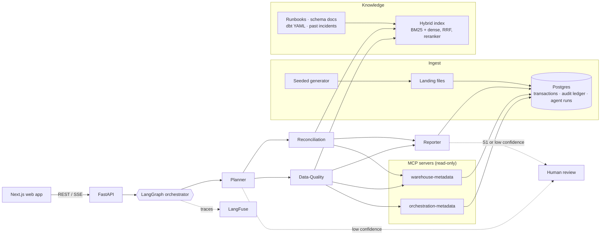

# Architecture

How ReconMind is put together, one layer at a time. For the short version, read [How it works](../README.md#how-it-works) in the README first.

## System view



| Layer | What it does | Code |
|---|---|---|
| Synthetic pipeline | A seeded generator writes landing files; a loader puts them into Postgres | [`app/pipeline/`](../app/pipeline) |
| Tool servers | Two read-only MCP servers expose warehouse and orchestrator metadata | [`mcp_servers/`](../mcp_servers) |
| Knowledge | Runbooks, schema docs, dbt models and past incidents, indexed for hybrid search | [`corpus/`](../corpus), [`app/retrieval/`](../app/retrieval) |
| Agents | A LangGraph graph: Planner, specialists, Reporter, human review | [`app/agents/`](../app/agents) |
| Domain | Every business rule, behind the `DomainAdapter` protocol | [`app/domain/`](../app/domain) |
| Models | Provider fallback chain, a traced client, structured output | [`app/llm/`](../app/llm) |
| Tracing | Every step to Postgres, mirrored to LangFuse | [`app/observability/`](../app/observability) |
| API | FastAPI: REST, server-sent events for chat, auth and rate limits | [`app/api/`](../app/api) |
| Web app | Dashboard, incidents, review queue, chat, docs, traces | [`frontend/`](../frontend) |

## The agent graph

```
planner --(low confidence)--> plan_review --+
   |                                        |
   +--(answer)--> answer -------------------+--> finalize
   |                                        |
   +--(investigate)--> one node per specialist (run concurrently)
                              |
                           reporter --(S1 or low confidence)--> report_review --> finalize
```

| Node | Module | Job |
|---|---|---|
| `planner` | [`planner.py`](../app/agents/planner.py) | Keyword rules route the question: answer from the runbooks, investigate with some or all specialists, or unclear. A model, if available, may refine the routing but only to specialists the adapter defines. |
| `plan_review` | [`review.py`](../app/agents/review.py) | When the Planner's confidence is below `PLANNER_CONFIDENCE_THRESHOLD`, a person picks the specialists or rejects the run. |
| `reconciliation`, `data_quality` | [`specialists.py`](../app/agents/specialists.py) | Built from the adapter's roster, one node per role, run in the same superstep so they execute concurrently. Each runs its checks, retrieves runbooks for every finding, and writes an analysis. |
| `reporter` | [`reporter.py`](../app/agents/reporter.py) | Builds `IncidentReport`s, applies the review rule (S1, or root-cause confidence below `REVIEW_CONFIDENCE_THRESHOLD`), stores them and writes the run summary. |
| `report_review` | [`review.py`](../app/agents/review.py) | Pauses with `interrupt()` until every pending report has a decision. |
| `answer` | [`answerer.py`](../app/agents/answerer.py) | Answers runbook questions from retrieved passages, with citations. |

Every node is wrapped by the tracer, and every node receives the same [`AgentDeps`](../app/agents/deps.py): the domain adapter, the MCP toolbox, retrieval, the traced model client and the run store.

**Facts versus language.** Checks produce `Finding`s with counts and evidence. The model (or the adapter's template) only writes the root-cause hypothesis, fix steps, confidence and open questions, validated by Pydantic. A model's confidence is capped at the template's calibrated prior plus 0.15, and the review gate uses the lower of the two, so a model can push a finding into review but never talk it out of one ([ADR 0010](adr/0010-facts-from-checks-language-from-models.md)).

**Pausing and resuming.** `interrupt()` stores the graph state in the checkpointer: `AsyncPostgresSaver` when there is a database, in memory otherwise. A review decision arrives through `POST /review/...`, which resumes the same thread id with `Command(resume=...)`. Because the checkpoint is in Postgres, the decision can arrive hours later, after a restart, or at a different API instance.

**Repeated scans.** A finding's fingerprint is `finding_type:title`, and titles carry the subject and size. A later scan that sees the same finding increments `seen_count` on the existing report instead of creating a new one, and doesn't pause for it again ([ADR 0011](adr/0011-scheduled-scans-and-finding-fingerprints.md)).

## MCP tool servers

Both servers are read-only, validate their arguments, and run over stdio (a subprocess per server, the default locally), streamable HTTP (their own containers in docker compose) or in-process (one small container on Render). The agents reach them only through [`MCPToolBox`](../app/tools/mcp_toolbox.py), which records every call as a trace step ([ADR 0008](adr/0008-mcp-over-direct-clients.md)).

| Server | Tool | Returns |
|---|---|---|
| warehouse-metadata | `list_tables` | Warehouse tables with row counts |
| | `get_table_schema` | A table's physical columns, plus the dbt contract when one exists |
| | `get_dbt_manifest` | Sources and models from the dbt manifest, with columns |
| | `get_table_stats` | Per-file row counts, headers, nulls and landing times for one table and day |
| | `run_check` | A named reconciliation check (`duplicate_keys`, `key_drift`) over a date range |
| orchestration-metadata | `list_dag_runs` | Runs of a DAG, optionally since a business date |
| | `get_task_log` | State, timing and log lines for one task in one run |
| | `get_timing_history` | Per-task duration history and median |
| | `get_failed_tasks` | Tasks that failed since a business date |

## Retrieval

1. **Corpus.** Markdown in [`corpus/`](../corpus) (9 runbooks, 5 schema docs, 5 past incidents) and the dbt model YAML: 23 documents, 86 chunks.
2. **Chunking.** By markdown section, then by size, with the document title and section carried into every chunk ([ADR 0001](adr/0001-chunk-by-markdown-section.md)).
3. **Sparse.** BM25 (`rank_bm25`, k1 = 1.2, b = 0.5) with a tokenizer that keeps identifiers like `channel_basket_id` whole and also indexes their parts, plus Snowball stemming.
4. **Dense.** `all-MiniLM-L6-v2` embeddings (sentence-transformers locally, the same weights on onnxruntime in the container), in FAISS or Pinecone. The index is cached on disk under a fingerprint of the chunks and model, so it's rebuilt only when either changes.
5. **Fusion.** Reciprocal rank fusion (k = 60) over the top 20 from each ([ADR 0002](adr/0002-hybrid-retrieval-with-rrf.md)).
6. **Reranking.** A MiniLM MS MARCO cross-encoder re-scores the fused top 10.
7. **Prompting.** Passages are wrapped in numbered `<passage>` tags inside a `<context>` block, with any tag a document could use to break out removed ([`app/rag/prompts.py`](../app/rag/prompts.py)).

## Data model

| Table | Holds |
|---|---|
| `transactions` | Loaded rows, one per file row, with the submitter file name |
| `file_loads` | One row per landed file: header, missing and unexpected columns, landing time |
| `submitter_registry`, `outlet_location_map`, `outlet_alias` | Reference data |
| `agent_runs` | One row per run: trigger, question, plan, status, summary, tokens, cost, latency, trace link |
| `agent_steps` | Every traced step: node, kind (node, tool, retrieval, llm), input, output, latency, tokens, cost |
| `incident_reports` | The reports, with status, review decision, reviewer, fingerprint and seen count |
| `chat_sessions`, `chat_messages` | Conversation memory |
| `audit_ledger` | Append-only record of findings and review decisions; a trigger rejects UPDATE, DELETE and TRUNCATE ([ADR 0004](adr/0004-append-only-ledger-in-postgres.md)) |
| `checkpoint*` | LangGraph's checkpoint tables, created by the saver |

Migrations are in [`migrations/versions/`](../migrations/versions).

## Where state lives

For running more than one API instance:

| State | Where | Shared across instances |
|---|---|---|
| Runs, steps, reports, decisions, chat, ledger | Postgres | yes |
| Paused runs | LangGraph checkpoints in Postgres | yes |
| Vector index | FAISS in each process, or Pinecone | FAISS: identical copies built from the same files; Pinecone: one shared index |
| Rate-limit counters | In process | no (each instance limits on its own) |
| Model provider cooldown | In process | no (harmless: each instance learns on its own) |

## Synthetic data

[`scripts/generate_synthetic_pipeline.py`](../scripts/generate_synthetic_pipeline.py) is seeded (`--seed 42` by default) and byte-for-byte reproducible; a test regenerates the committed sample and fails if a single byte differs. It writes what a real landing zone would hold: 85 pipe-delimited submitter files over 21 business days (8,461 rows), reference data, an Airflow-style DAG run log with one failed task, dbt model YAML with a manifest, the [data dictionary](../data/DATA_DICTIONARY.md) and [`expected_anomalies.json`](../data/sample/expected_anomalies.json) with the exact size of every planted problem.

| Planted anomaly | Where | Size |
|---|---|---|
| Key drift | `LOC-0517` also reports as `OUT-1071` | 251 rows, 3.0% |
| Duplicate submission | ECOMM resends 2026-06-12 after the DAG ran | 88 keys, 3 with changed values |
| Schema drift | MOBILE 2026-06-16 renames `channel_basket_id` to `basket_ref`; `validate_schema` fails | 82 rows |
| Volume anomaly | POSFEED 2026-06-18 lands 161 minutes late | 110 rows vs 182.6 trailing (40% below) |

## Domain adapters

The agents never import a business rule. They code against [`DomainAdapter`](../app/domain/protocol.py): a roster of specialists, `resolve_scope`, `run_checks`, `severity`, `problem_statement`, `retrieval_query`, `fallback_analysis` and `overview`.

- [`retail_recon/`](../app/domain/retail_recon) is the project's domain: [`rules.py`](../app/domain/retail_recon/rules.py) (keys and thresholds), [`checks.py`](../app/domain/retail_recon/checks.py) (what each specialist checks), [`writeups.py`](../app/domain/retail_recon/writeups.py) (severity rubric and wording) and [`adapter.py`](../app/domain/retail_recon/adapter.py) (the roster that wires them).
- [`example_support_triage/`](../app/domain/example_support_triage) is a deliberately small second domain with different specialists and finding types. A test boots the same graph on it in every CI run, and another fails if any file under `app/agents/` imports a domain module.

Swap the data, the two MCP servers and the adapter, and retrieval, the agent graph, tracing and the web app stay as they are. Claims matching (healthcare), ticket triage (SaaS) and feed monitoring (trading) all fit this shape.
